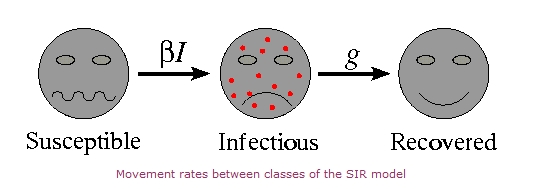

---
## Front matter
lang: ru-RU
title: "Модель эпидемии (SIR)"
subtitle: "Математическое моделирование"
author: 
  - Астраханцева А. А.
teacher:
  - преподаватель: Кулябов Дмитрий Сергеевич, доктор физико-математических наук, профессор
institute:
  - Российский университет дружбы народов, Москва, Россия

date: 18 марта 2025

## i18n babel
babel-lang: russian
babel-otherlangs: english

## Formatting pdf
toc: false
toc-title: Содержание
slide_level: 2
aspectratio: 169
section-titles: true
theme: metropolis
header-includes:
 - \metroset{progressbar=frametitle,sectionpage=progressbar,numbering=fraction}
---

# Информация

## Докладчик

:::::::::::::: {.columns align=center}
::: {.column width="70%"}

  * Астраханцева Анастасия Александровна
  * НФИбд-01-22, 1132226437
  * Российский университет дружбы народов
  * [1132226437@pfur.ru](mailto:1132226437@pfur.ru)
  * <https://github.com/aaastrakhantseva>

:::
::: {.column width="30%"}

:::
::::::::::::::

# Введение

## Актуальность

Инфекционные заболевания представляют серьезную угрозу из-за глобализации и мобильности населения. Эпидемиологическое моделирование становится ключевым инструментом для их прогнозирования и управления.

## Объект и предмет

**Объект исследования**: SIR-модель как система дифференциальных уравнений, описывающая динамику распространения инфекционных заболеваний.

**Предмет исследования**: Влияние ключевых параметров, таких как базовый индекс репродукции ($R_0$) и скорость распространения болезни, на динамику эпидемии. 

## SIR-модель: Основы

- Уильям Огилви Кермак и Андерсон Грей Маккендрик (1927) 
- Группы: $S$ (Восприимчивые), $I$ (Инфицированные), $R$ (Выздоровевшие)
- Допущения: однородность, замкнутость,  постоянство параметров

## Уравнения

$$
\begin{cases}
\dot{S} = \frac{dS}{dt} = -\beta SI, \\
\dot{I} = \frac{dI}{dt} = \beta SI - \gamma I, \\
\dot{R} = \frac{dR}{dt} = \gamma I,
\end{cases}
$$
где:

- $\frac{dS}{dt}$ — скорость изменения численности восприимчивых особей.
- $\frac{dI}{dt}$ — скорость изменения численности инфицированных особей.
- $\frac{dR}{dt}$ — скорость изменения численности выздоровевших особей.

## Применение SIR-модели

Примеры использования SIR-модели:

   - Грипп: SIR-модель используется для прогнозирования сезонных вспышек гриппа и оценки эффективности вакцинации в снижении заболеваемости.
   - Корь: Модель применяется для анализа динамики кори и определения порогов вакцинации, необходимых для предотвращения эпидемий.
   - COVID-19: В период пандемии COVID-19, SIR-модель была использована для оценки различных сценариев распространения вируса и разработки стратегий контроля.
   - Другие инфекционные заболевания: SIR-модель также используется для прогнозирования и анализа динамики других инфекционных заболеваний, таких как ВИЧ, туберкулез и малярия.
   

# Моделирование и результаты

## Симуляция в XCos

{#fig:004 width=70%}

## Таблица результатов

: Результаты симуляции с различными параметрами 

| Параметр $\beta$   | Параметр $\gamma$ | $R_0$   | Пик заболеваемости | Время достижения пика | Итоговая доля переболевших |
|------------|----------|------|--------------------|-----------------------|---------------------------|
| 0.3        | 1        | 0.3  | -             | -                  | 0                     |
| 1          | 0.3        | 3.33 | $\approx 0.34$             | $\approx 10.5$                    | $\approx 0.95$                      |
| 1          | 1        | 1    | -              | -                   | -                     |
| 1          | 0.5        | 2    | $\approx 0.14$              | $\approx 13.5$                   | $\approx 0.78$                     |

## Выводы

SIR-модель остаётся ключевым инструментом для анализа динамики эпидемий. Анализ различных сценариев с разными значениями $\beta$ и $\gamma$ демонстрирует, как скорость заражения и скорость выздоровления влияют на пик заболеваемости, время его достижения и итоговую долю переболевших.

## Список литературы{.unnumbered}

[1] Контагиозность. // Большая российская энциклопедия : электронная версия. – URL: https://bigenc.ru/c/kontagioznost-c3a8d8 (дата обращения: 17.03.2025).

[2] Martcheva, M. *An Introduction to Mathematical Epidemiology*. Springer, 2015.

[3] Kermack, W. O., and A. G. McKendrick. "A Contribution to the Mathematical Theory of Epidemics." *Proceedings of the Royal Society of London. Series A, Containing Papers of a Mathematical or Physical Character* 115.772 (1927): 700-721.

[4] Anderson, R. M., and R. M. May. *Infectious Diseases of Humans: Dynamics and Control*. Oxford University Press, 1991.

[5] *WHO (World Health Organization).* URL: https://www.who.int/ru/news-room/fact-sheets/detail/global-health-risks

[6] Вирулентность. – URL: https://www.booksite.ru/fulltext/1/001/008/005/285.htm

