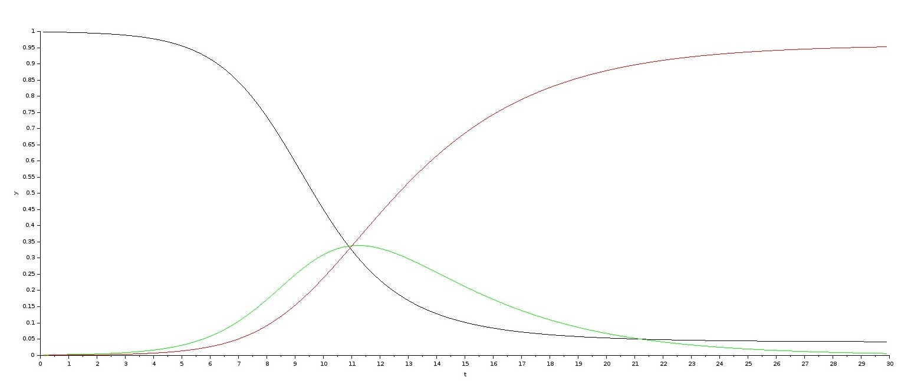
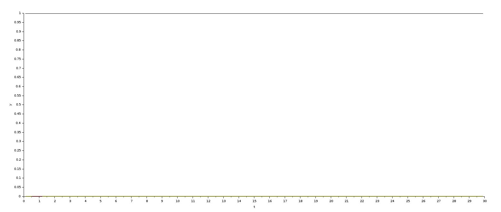
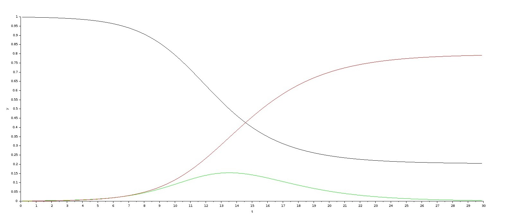
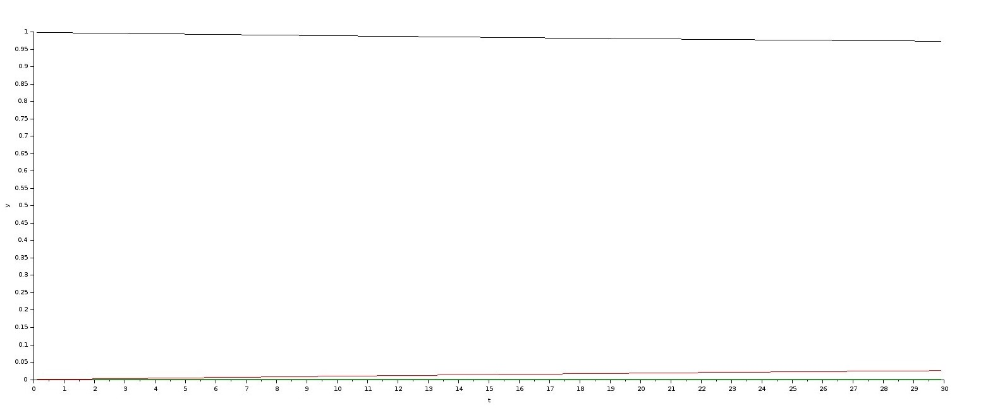

---
## Front matter
title: "Модель эпидемии (SIR)"
subtitle: Математическое моделирование
author: "Астраханцева А. А."

## Generic otions
lang: ru-RU
toc-title: "Содержание"

## Bibliography
bibliography: bib/cite.bib
csl: pandoc/csl/gost-r-7-0-5-2008-numeric.csl

## Pdf output format
toc: true # Table of contents
toc-depth: 2
lof: true # List of figures
lot: true # List of tables
fontsize: 12pt
linestretch: 1.5
papersize: a4
documentclass: scrreprt
## I18n polyglossia
polyglossia-lang:
  name: russian
  options:
	- spelling=modern
	- babelshorthands=true
polyglossia-otherlangs:
  name: english
## I18n babel
babel-lang: russian
babel-otherlangs: english
## Fonts
mainfont: PT Serif
romanfont: PT Serif
sansfont: PT Sans
monofont: PT Mono
mainfontoptions: Ligatures=TeX
romanfontoptions: Ligatures=TeX
sansfontoptions: Ligatures=TeX,Scale=MatchLowercase
monofontoptions: Scale=MatchLowercase,Scale=0.9
## Biblatex
biblatex: true
biblio-style: "gost-numeric"
biblatexoptions:
  - parentracker=true
  - backend=biber
  - hyperref=auto
  - language=auto
  - autolang=other*
  - citestyle=gost-numeric
## Pandoc-crossref LaTeX customization
figureTitle: "Рис."
tableTitle: "Таблица"
listingTitle: "Листинг"
lofTitle: "Список иллюстраций"
lotTitle: "Список таблиц"
lolTitle: "Листинги"
## Misc options
indent: true
header-includes:
  - \usepackage{indentfirst}
  - \usepackage{float} # keep figures where there are in the text
  - \floatplacement{figure}{H} # keep figures where there are in the text
---

# Введение

## Цель доклада

Изучить основные принципы SIR-модели и её применение для анализа динамики эпидемий, а также оценить влияние ключевых параметров ($R_0$, скорость заражения, скорость выздоровления и вакцинация) на распространение инфекционных заболеваний.

## Актуальность темы

В современном мире, характеризующемся высокой степенью глобализации и мобильности населения, инфекционные заболевания представляют собой серьезную угрозу для здоровья общества и стабильности экономики [4]. Эпидемии и пандемии, такие как вспышки гриппа, кори, COVID-19 и других заболеваний, могут быстро распространяться, оказывая существенное влияние на системы здравоохранения, социальную инфраструктуру и экономическую активность. В связи с этим эпидемиологическое моделирование становится неотъемлемым инструментом для прогнозирования, анализа и управления распространением инфекционных заболеваний [2]. Точные прогнозы позволяют принимать своевременные меры для предотвращения распространения и снижения негативного влияния на социум.

## Объект и предмет исследования

**Объект исследования**: SIR-модель как система дифференциальных уравнений, описывающая динамику распространения инфекционных заболеваний.

**Предмет исследования**: Влияние ключевых параметров, таких как базовый индекс репродукции ($R_0$) и скорость распространения болезни, на динамику эпидемии. Анализ эффективности мер контроля и планирования ресурсов здравоохранения на основе модели.

## Исторический контекст и основные положения

SIR-модель, разработанная Уильямом Огилви Кермаком и Андерсоном Греем Маккендриком в 1927 году [3], представляет собой одну из самых фундаментальных и широко используемых математических моделей в эпидемиологии. Эта модель была предложена в их статье "A Contribution to the Mathematical Theory of Epidemics" и с тех пор стала основой для понимания и анализа динамики инфекционных заболеваний. Модель сыграла ключевую роль в развитии современных подходов к эпидемиологическому моделированию.

## Представление SIR-модели

SIR-модель описывает популяцию как совокупность трех групп, которые изменяются во времени под воздействием инфекции:

1. Susceptible (S) — Восприимчивые: Это группа здоровых особей, которые находятся в группе риска и могут подхватить инфекцию. Они еще не заражены, но подвержены воздействию заболевания.

2. Infected (I) — Инфицированные: Это группа зараженных особей, которые являются переносчиками болезни и могут передавать ее восприимчивым особям.

3. Recovered (R) — Выздоровевшие: Это группа особей, которые выздоровели после заражения и приобрели иммунитет к болезни. В эту группу также могут быть включены особи, которые умерли от заболевания.

## Основные допущения модели

SIR-модель основана на ряде допущений, которые упрощают реальную картину распространения инфекции, но позволяют получить общее представление о динамике эпидемии:

1. Однородность популяции: Предполагается, что все особи в популяции одинаково восприимчивы к инфекции и имеют одинаковую вероятность контакта с инфицированными. Это означает, что не учитываются возрастные группы, различия в иммунитете или социальные факторы. На практике это допущение означает, что модель дает усредненную картину, которая может не соответствовать отдельным группам населения.

2. Замкнутость системы: Модель предполагает, что популяция является замкнутой, то есть отсутствуют внешние факторы, такие как рождение, смерть (кроме смерти от рассматриваемого заболевания), миграция или введение новых особей в популяцию. В реальности же миграция и другие демографические процессы могут существенно повлиять на динамику эпидемии.

3. Постоянные параметры: Модель предполагает, что параметры, такие как скорость заражения и скорость выздоровления, остаются постоянными во времени. В реальности эти параметры могут изменяться в зависимости от сезонности, мер контроля и других факторов.

Эти допущения позволяют упростить математическую модель и получить общее представление о динамике эпидемии, однако важно учитывать их ограничения при интерпретации результатов и применении модели к реальным ситуациям. Понимание этих ограничений способствует разработке более сложных и реалистичных моделей.

## Задачи доклада:
1. Описание математической формулировки модели.
2. Анализ влияния ключевых параметров на динамику эпидемии.
3. Демонстрация примеров симуляции модели с различными параметрами.

# Математическое описание модели

SIR-модель описывает динамику распространения инфекционного заболевания в популяции с помощью системы дифференциальных уравнений, которые отражают изменение численности восприимчивых (S), инфицированных (I) и выздоровевших (R) особей во времени.
Система дифференциальных уравнений имеет следующий вид:
$$
\begin{cases}
\dot{S} = \frac{dS}{dt} = -\beta SI, \\
\dot{I} = \frac{dI}{dt} = \beta SI - \gamma I, \\
\dot{R} = \frac{dR}{dt} = \gamma I,
\end{cases}
$$
где:

- $\frac{dS}{dt}$ — скорость изменения численности восприимчивых особей.
- $\frac{dI}{dt}$ — скорость изменения численности инфицированных особей.
- $\frac{dR}{dt}$ — скорость изменения численности выздоровевших особей.

## Определение параметров

1. Скорость заражения ($\beta$):
   - Параметр $\beta$ (бета) представляет собой скорость передачи инфекции от инфицированных особей к восприимчивым. Он определяет вероятность того, что при контакте между восприимчивой и инфицированной особью произойдет заражение.
   
   - Единицы измерения: (особей * время)^-1
   
   - Биологический смысл: отражает контагиозность заболевания и частоту контактов между особями [1]. На скорость заражения могут влиять такие факторы, как плотность населения, социальные нормы и эффективность мер контроля.

2. Скорость выздоровления ($\gamma$):
   - Параметр $\gamma$ (гамма) представляет собой скорость выздоровления инфицированных особей. Он определяет, как быстро инфицированные особи выздоравливают и переходят в группу выздоровевших (R).
   
   - Единицы измерения: время^-1
   
   - Биологический смысл: отражает вирулентность [6] заболевания и эффективность лечения. Улучшение медицинского обслуживания и разработка новых лекарственных препаратов могут увеличить скорость выздоровления.

3. Базовый индекс репродукции ($R_0$):

   - Базовый индекс репродукции ($R_0$) определяется как среднее количество новых случаев заболевания, которое может вызвать один инфицированный человек в полностью восприимчивой популяции.
   
   - Формула для расчета: $$ R_0 = \frac{\beta}{\gamma} $$
   
   - Значение $R_0$ является ключевым параметром для определения того, будет ли эпидемия развиваться. Если $R_0$ > 1, эпидемия может распространиться в популяции; если $R_0$ < 1, инфекция со временем исчезнет.

## Анализ устойчивости

Анализ устойчивости SIR-модели позволяет понять, как система реагирует на небольшие изменения в начальных условиях. Это позволяет определить, какие параметры наиболее важны для контроля эпидемии.

* Точка устойчивости без заболевания: $(S, I, R) = (N, 0, 0)$, где N - размер популяции.
* Устойчивость в эндемичном состоянии (если $R_0$ > 1): требует более сложного анализа для определения устойчивости в зависимости от параметров.

# Применение SIR-модели

## Прогнозирование динамики эпидемий

SIR-модель широко используется для прогнозирования динамики эпидемий, что включает в себя анализ зависимости между параметрами модели и кривыми заболеваемости. Это позволяет исследователям понимать, как изменения в таких параметрах, как скорость заражения ($\beta$) и скорость выздоровления ($\gamma$), влияют на развитие эпидемии.

1. Анализ зависимости между параметрами и кривыми заболеваемости включает в себя исследование того, как изменения в $R_0, \beta, \gamma$ влияют на пик заболеваемости, время достижения пика и итоговую долю переболевших. А также, анализ того, как эти параметры влияют на форму кривых заболеваемости и на общую динамику эпидемии.

2. Примеры использования SIR-модели:
   - Грипп: SIR-модель используется для прогнозирования сезонных вспышек гриппа и оценки эффективности вакцинации в снижении заболеваемости.
   - Корь: Модель применяется для анализа динамики кори и определения порогов вакцинации, необходимых для предотвращения эпидемий.
   - COVID-19: В период пандемии COVID-19, SIR-модель была использована для оценки различных сценариев распространения вируса и разработки стратегий контроля.
   - Другие инфекционные заболевания: SIR-модель также используется для прогнозирования и анализа динамики других инфекционных заболеваний, таких как ВИЧ, туберкулез и малярия.

## Оценка эффективности мер контроля

Важным применением SIR-модели является оценка эффективности различных мер контроля, таких как вакцинация, карантин, социальное дистанцирование и использование масок.

1. Влияние вакцинации на снижение $R_0$ и предотвращение эпидемий:
   - Вакцинация снижает долю восприимчивых особей (S) в популяции, что приводит к снижению базового индекса репродукции ($R_0$).
   - Эффективность вакцинации может быть оценена путем сравнения динамики эпидемии при различных уровнях охвата вакцинацией.
   - Порог коллективного иммунитета может быть определен на основе SIR-модели, что позволяет планировать вакцинацию и снизить $R_0$ до значений менее единицы [5].

2. Анализ влияния карантинных мероприятий на скорость заражения:
   - Карантинные мероприятия и социальное дистанцирование снижают скорость заражения $\beta$) за счет уменьшения контактов между особями.
   - Анализ влияния карантинных мер на динамику эпидемии позволяет оценить их эффективность и определить оптимальную продолжительность карантина.
   - Введение дополнительных ограничений, таких как ношение масок и ограничение массовых мероприятий, также способствует снижению скорости заражения.

3. Влияние противовирусной терапии:
   - Противовирусная терапия может увеличить скорость выздоровления $\gamma$, что приведет к снижению продолжительности инфекционного периода и снижению числа зараженных.
   - Включение противовирусной терапии в SIR-модель позволяет оценить её влияние на динамику эпидемии и оптимизировать стратегии лечения.

## Пример: Анализ влияния вакцинации на эпидемию кори

Рассмотрим пример анализа влияния вакцинации на эпидемию кори. Предположим, что базовый индекс репродукции для кори составляет $R_0$ = 15. Для достижения коллективного иммунитета необходимо вакцинировать не менее $V = 1 - 1/R_0  = 1 - 1/15 ≈ 0.93$, или 93% населения.

Симуляция SIR-модели с параметрами, соответствующими кори, и различными уровнями охвата вакцинацией позволяет оценить, как снижение доли восприимчивых особей влияет на пик заболеваемости и общее число инфицированных. Это позволяет определить оптимальный уровень вакцинации для предотвращения эпидемии и разработать эффективные стратегии вакцинации.

# Симуляция SIR-модели в xcos (демонстрация)

## Описание симуляции

Для демонстрации динамики SIR-модели была построена симуляция в среде xcos.

1. Процесс построения модели:
   - Были созданы блоки для интеграторов, которые решают дифференциальные уравнения для $S, I, R$. В блоках интегрирования заданы начальные параметры $s(0) = 0, 999, i(0) = 0, 001$$.
   
   - Блоки GAINBLK использовались для задания параметров скорости заражения ($\beta$) и скорости выздоровления ($\gamma$).
   
   - Осциллограф (Scope) использовался для визуализации графиков динамики $S(t), I(t), R(t)$.

2. Параметры симуляции:
   - Скорость заражения: $\beta = 1$
   - Скорость выздоровления: $\gamma = 0.3$
   - Начальные условия: $S(0) = 0.999$, $I(0) = 0.001$, $R(0) = 0$
   Эти параметры позволяют смоделировать динамику эпидемии с относительно высокой скоростью заражения и умеренной скоростью выздоровления.

Дифференциальные уравнения, описывающие модель SIR, могут быть представлены в качестве такой схемы в xcos (рис. [-@fig:001]).

{#fig:001 width=70%}

## Демонстрация результатов с разными параметрами

При запуске симуляции рисуется график распространения эпидемии (рис. [-@fig:002]).

{#fig:002 width=70%}

Модель демонстрирует масштабную эпидемию, где доля восприимчивых особей быстро снижается, достигая низкого уровня, а доля инфицированных сначала увеличивается, достигает пика, а затем уменьшается. Доля выздоровевших постепенно увеличивается и стабилизируется на высоком уровне, указывая на формирование устойчивого иммунитета в популяции. Высокая скорость заражения и относительно низкая скорость выздоровления способствуют быстрому распространению инфекции, что приводит к тому, что большая часть популяции переболевает. Базовый репродуктивный индекс $$R_0 \approx 3.33$$ подтверждает, что эпидемия будет быстро распространяться, поскольку каждый инфицированный заражает в среднем более трех новых людей.

Ниже переведены графики распространения эпидемии с различными параметрами (рис. [-@fig:003] - [-@fig:005]).

{#fig:003 width=70%}

{#fig:004 width=70%}

{#fig:005 width=70%}

## Влияние изменений параметров на динамику

Для наглядного представления влияния изменения параметров на динамику эпидемии, проведем симуляции с различными значениями скорости заражения и скорости выздоровления (табл. [-@tbl:std-dir]).

: Результаты симуляции с различными параметрами {#tbl:std-dir}

| Параметр $\beta$   | Параметр $\nu$ | $R_0$   | Пик заболеваемости | Время достижения пика | Итоговая доля переболевших |
|------------|----------|------|--------------------|-----------------------|---------------------------|
| 0.3        | 1        | 0.3  | -             | -                  | 0                     |
| 1          | 0.3        | 3.33 | $\approx 0.34$             | $\approx 10.5$                    | $\approx 0.95$                      |
| 1          | 1        | 1    | -              | -                   | -                     |
| 1          | 0.5        | 2    | $\approx 0.14$              | $\approx 13.5$                   | $\approx 0.78$                     |

Результаты симуляции показывают, что уменьшение скорости заражения и увеличение скорости выздоровления приводят к снижению пика заболеваемости и уменьшению итоговой доли переболевших.

# Расширения и ограничения SIR-модели

## Расширения модели

SIR-модель может быть расширена для учета дополнительных факторов, что позволяет лучше описывать реальные сценарии распространения инфекций. Например, SIRS-модель включает возможность возврата особей из группы выздоровевших обратно в группу восприимчивых, что актуально для заболеваний с непостоянным иммунитетом. Эта модель используется для анализа заболеваний, где возможен повторный заражение, таких как некоторые вирусные инфекции.

SEIR-модель вводит дополнительную группу — Exposed (E), представляющую особей в инкубационном периоде, что позволяет более точно описывать динамику заболеваний с длительным инкубационным периодом, как, например, COVID-19. Кроме того, расширенные модели могут учитывать смертность и рождаемость в популяции, что важно для долгосрочного прогнозирования и анализа демографических тенденций. Учет вакцинации также возможен, что позволяет анализировать ее влияние на динамику эпидемии и определять пороги вакцинации для предотвращения эпидемий.

## Ограничения модели

Однако SIR-модель имеет ограничения. Она предполагает однородность популяции, что не учитывает различия в поведении и иммунитете. Модель также не учитывает пространственную структуру популяции и различия в плотности населения, что может существенно влиять на распространение инфекции. Кроме того, SIR-модель не может адекватно описывать сложные социальные взаимодействия, такие как поведение людей в разных условиях, что влияет на скорость заражения. В связи с этими ограничениями SIR-модель следует использовать с осторожностью и в сочетании с другими методами анализа и экспертными знаниями.

# Заключение

SIR-модель является важным инструментом для понимания динамики эпидемий и анализа влияния ключевых параметров на распространение заболеваний. Параметры модели, такие как базовый индекс репродукции ($R_0$), скорость заражения и выздоровления, играют ключевую роль в определении масштаба и скорости распространения заболевания. В ходе работы были выявлены основные принципы модели, а также проведен анализ её возможностей для планирования мер контроля.

В перспективе использования модели важно развивать более сложные модели, которые учитывают дополнительные факторы, такие как пространственная структура, социальные взаимодействия и инкубационный период, для более точного прогнозирования. Эти модели могут быть использованы для планирования мер контроля и оптимизации распределения ресурсов здравоохранения, что особенно важно в условиях ограниченности ресурсов. Дальнейшие исследования и развитие SIR-модели будут направлены на учет этих дополнительных факторов и повышение точности прогнозирования эпидемий.

# Список литературы{.unnumbered}

[1] Контагиозность. // Большая российская энциклопедия : электронная версия. – URL: https://bigenc.ru/c/kontagioznost-c3a8d8 (дата обращения: 17.03.2025).

[2] Martcheva, M. *An Introduction to Mathematical Epidemiology*. Springer, 2015.

[3] Kermack, W. O., and A. G. McKendrick. "A Contribution to the Mathematical Theory of Epidemics." *Proceedings of the Royal Society of London. Series A, Containing Papers of a Mathematical or Physical Character* 115.772 (1927): 700-721.

[4] Anderson, R. M., and R. M. May. *Infectious Diseases of Humans: Dynamics and Control*. Oxford University Press, 1991.

[5] *WHO (World Health Organization).* URL: https://www.who.int/ru/news-room/fact-sheets/detail/global-health-risks

[6] Вирулентность. – URL: https://www.booksite.ru/fulltext/1/001/008/005/285.htm (дата обращения: 19.03.2025).

