---
## Front matter
lang: ru-RU
title: "Лабораторная работа №1"
subtitle: "Работа с git"
author: 
  - Астраханцева А. А.
institute:
  - Российский университет дружбы народов, Москва, Россия
date: 22 февраля 2025

## i18n babel
babel-lang: russian
babel-otherlangs: english

## Formatting pdf
toc: false
toc-title: Содержание
slide_level: 2
aspectratio: 169
section-titles: true
theme: metropolis
header-includes:
 - \metroset{progressbar=frametitle,sectionpage=progressbar,numbering=fraction}
---

# Информация

## Докладчик

:::::::::::::: {.columns align=center}
::: {.column width="70%"}

  * Астраханцева Анастасия Александровна
  * НФИбд-01-22, 1132226437
  * Российский университет дружбы народов
  * [1132226437@pfur.ru](mailto:1132226437@pfur.ru)
  * <https://github.com/aaastrakhantseva>

:::
::: {.column width="30%"}


:::
::::::::::::::

# Вводная часть

## Цели лабораторной работы

Приобретение навыков работы с git и markdown.

# Выполнение ЛР

## Подготовка

{#fig:001 width=70%}

##  Создание проекта

```
mkdir hello
cd hello
touch hello.html
echo "Hello, World!" > hello.html
```

##  Создание проекта
```
git init
git add hello.html
git commit -m "Initial Commit"
git status
```
##  Создание проекта

{#fig:002 width=70%}

## Внесение изменений 

```
<h1>Hello, World!</h1>
```
Проверим состояние рабочего каталога.
```
git status
git add hello.html
git status
```
## Внесение изменений 

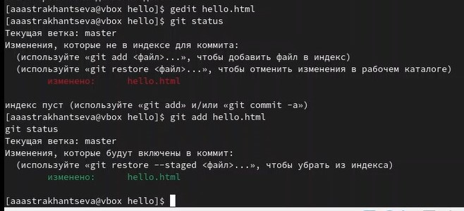{#fig:003 width=70%}

## Создание коммита
```
git commit
git status
```

## Изменим файл hello.html

```
<html>
<body>
<h1>Hello, World!</h1>
</body>
</html>
```
```
git add hello.html
```

## Изменение файл hello.html

```
<html>
<head>
</head>
<body>
<h1>Hello, World!</h1>
</body>
</html>
```

```
git status
```
## Просмотр состояния

{#fig:004 width=70%}

## Просмотр истории

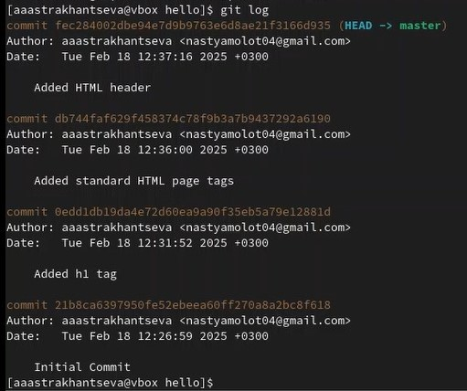{#fig:005 width=70%}

## Просмотр истории

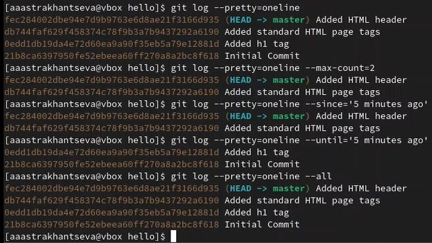{#fig:006 width=70%}

## Возврат к определенной версии репозитория

{#fig:007 width=70%}

##  Создание тэгов и переключение по ним

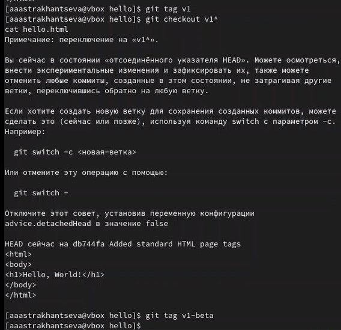{#fig:008 width=70%}

##  Создание тэгов и переключение по ним

{#fig:009 width=70%}

##  Создание тэгов в логе

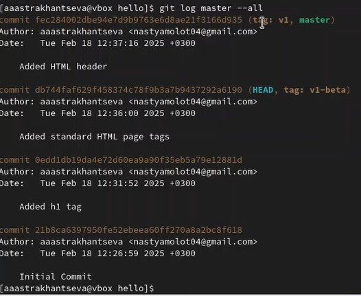{#fig:010 width=70%}

## Изменение файл hello.html

```
<html>
<head>
</head>
<body>
<h1>Hello, World!</h1>
<!-- This is a bad comment. We want to revert it. -->
</body>
</html>
```

## Проверим состояние рабочего каталога:

```
git status
git checkout hello.html
git status
cat hello.html
```
## Изменение файл hello.html

```
<html>
<head>
<!-- This is an unwanted but staged comment -->
</head>
<body>
<h1>Hello, World!</h1>
</body>
</html>
```

## Индексация и отмена индексации

```
git add hello.html
git status
```
```
git reset HEAD hello.html
```

## Индексация и отмена индексации

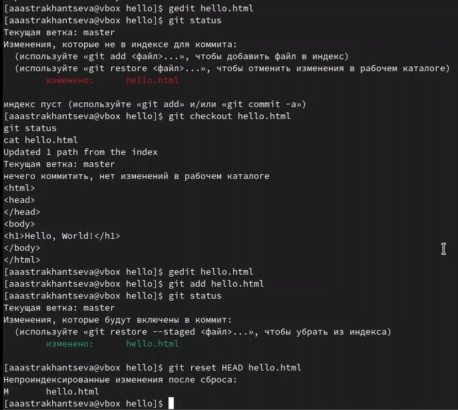{#fig:011 width=70%}

Переключимся на версию коммита: 
```
git checkout hello.html
git status
```

## Изменение файл hello.html

```
<html>
<head>
</head>
<body>
<h1>Hello, World!</h1>
<!-- This is an unwanted but committed change -->
</body>
</html>
```

## Отмена коммита

```
git add hello.html
git commit -m "Oops, we didn't want this commit"
```
```
git revert HEAD
```
## Отмена коммита

{#fig:012 width=70%}

## Удаление коммитов из ветки
 
```
git log
git tag oops
git reset --hard v1
git log
```

## Удаление коммитов из ветки

{#fig:013 width=70%}

##  Удаление тега 

```
git tag -d oops
git log --all
```
##  Удаление тега 

{#fig:014 width=70%}

## Внесение изменений в коммиты
 
```
git add hello.html
git commit --amend -m "Add an author/email comment"
```

## Внесение изменений в коммиты

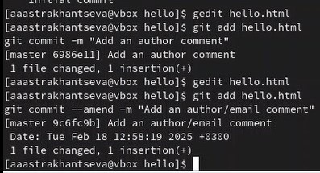{#fig:015 width=70%}

## Перемещение файлов

```
mkdir lib
git mv hello.html lib
git status
git commit -m "Moved hello.html to lib"
```
## Добавление файла index.html в репозиторий
```
<html>
<body>
<iframe src="lib/hello.html" width="200" height="200" />
</body>
</html>
```
## Перемещение файлов

{#fig:016 width=70%}

## Git внутри: Каталог .git

{#fig:017 width=70%}

## Работа непосредственно с объектами git 

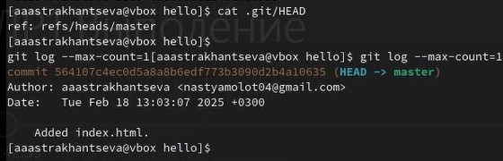{#fig:018 width=70%}

## Работа непосредственно с объектами git 

{#fig:019 width=70%}

## Работа непосредственно с объектами git 

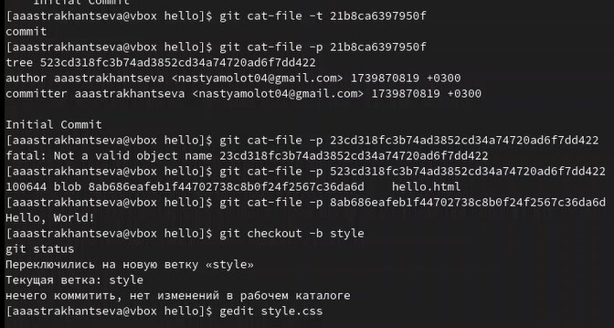{#fig:020 width=70%}

##  Создание ветки 

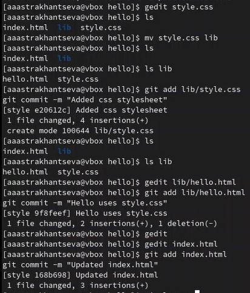{#fig:021 width=70%}

##  Просмотр лога

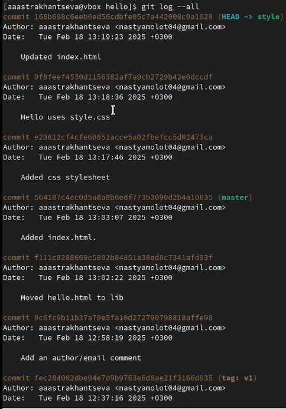{#fig:022 width=70%}

##  Создание отличий в ветках

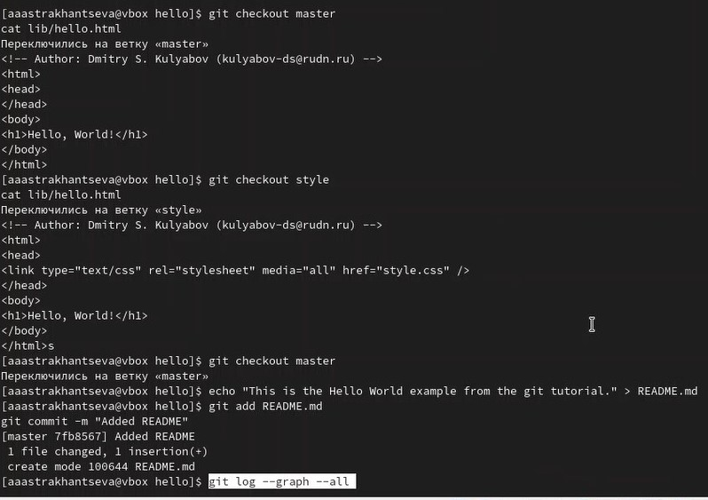{#fig:023 width=70%}

##  Просмотр графа

{#fig:024 width=70%}

## Слияние 

{#fig:025 width=70%}

## Сброс ветки 

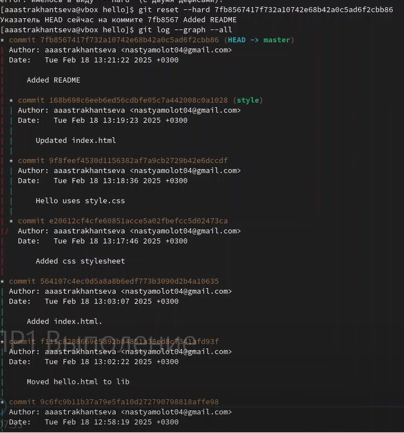{#fig:026 width=70%}

## Перебазирование 

{#fig:027 width=70%}

## Клонирование репозиториев


{#fig:028 width=70%}

## Просмотр истории репозитория

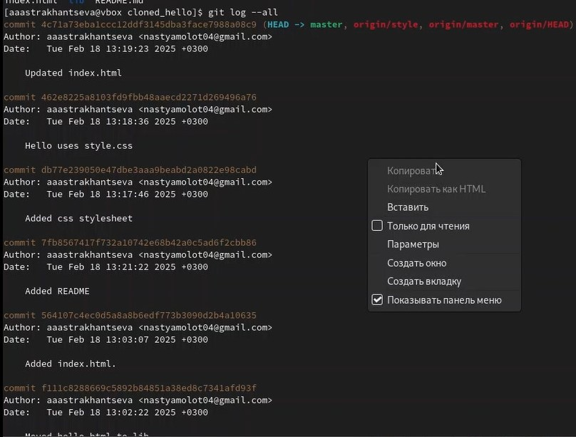{#fig:029 width=70%}

## Что такое origin?

{#fig:030 width=70%}

## Извлечение изменений 

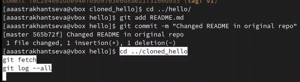{#fig:031 width=70%}

## . Слияние извлеченных изменений

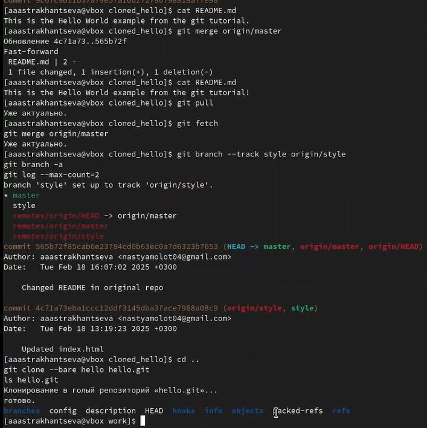{#fig:032 width=70%}

23. Отправка изменений 

{#fig:032 width=70%}


# Выводы

В ходе выполнения лабораторной работы я приобрела навыки работы с git и markdown.


# Спасибо за внимание!
