---
## Front matter
title: "Лабораторная работа №1"
subtitle: "Работа с git"
author: "Астраханцева А. А."

## Generic otions
lang: ru-RU
toc-title: "Содержание"

## Bibliography
bibliography: bib/cite.bib
csl: pandoc/csl/gost-r-7-0-5-2008-numeric.csl

## Pdf output format
toc: true # Table of contents
toc-depth: 2
lof: true # List of figures
lot: false # List of tables
fontsize: 12pt
linestretch: 1.5
papersize: a4
documentclass: scrreprt
## I18n polyglossia
polyglossia-lang:
  name: russian
  options:
	- spelling=modern
	- babelshorthands=true
polyglossia-otherlangs:
  name: english
## I18n babel
babel-lang: russian
babel-otherlangs: english
## Fonts
mainfont: PT Serif
romanfont: PT Serif
sansfont: PT Sans
monofont: PT Mono
mainfontoptions: Ligatures=TeX
romanfontoptions: Ligatures=TeX
sansfontoptions: Ligatures=TeX,Scale=MatchLowercase
monofontoptions: Scale=MatchLowercase,Scale=0.9
## Biblatex
biblatex: true
biblio-style: "gost-numeric"
biblatexoptions:
  - parentracker=true
  - backend=biber
  - hyperref=auto
  - language=auto
  - autolang=other*
  - citestyle=gost-numeric
## Pandoc-crossref LaTeX customization
figureTitle: "Рис."
tableTitle: "Таблица"
listingTitle: "Листинг"
lofTitle: "Список иллюстраций"
lotTitle: "Список таблиц"
lolTitle: "Листинги"
## Misc options
indent: true
header-includes:
  - \usepackage{indentfirst}
  - \usepackage{float} # keep figures where there are in the text
  - \floatplacement{figure}{H} # keep figures where there are in the text
---

# Цель работы

Приобретение навыков работы с git и markdown.


# Выполнение лабораторной работы
1. Подготовка

Настройка core.autocrlf с параметрами true и input делает все переводы строк текстовых файлов в главном  репозитории одинаковы. 

core.autocrlf true - git автоматически конвертирует CRLF->LF при коммите и обратно LF->CRLF при выгрузке кода из репозитория на файловую систему (используют в Windows). core.autocrlf input - конвертация CRLF в LF только
при коммитах (используют в Mac/Linux).

Если core.safecrlf установлен в true или warm, git проверяет, если преобразование является обратимым для текущей настройки core.autocrlf. core.safecrlf true - отвержение необратимого преобразования lf<->crlf.
Полезно, когда специфические бинарники похожие на текстовые файлы. core.safecrlf warn - печать только предупреждение, но принимает необратимый переход. (рис. [-@fig:001]).

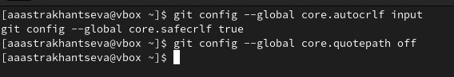{#fig:001 width=70%}

2.  Создание проекта

Начнем работу в пустом рабочем каталоге с создания пустого каталога с именем hello, затем войдем в него и создадим там файл с именем hello.html. 
```
mkdir hello
cd hello
touch hello.html
echo "Hello, World!" > hello.html
```

Создадим git репозиторий из этого каталога, выполнив команду:
```
git init
```

Добавим файл в репозиторий: 
```
git add hello.html
git commit -m "Initial Commit"
```

Проверим текщее состояние репозитория с помощью команды: 
```
git status
```
Команда проверки состояния сообщит, что коммитить нечего. Это означает, что в репозитории хранится текущее состояние рабочего каталога, и нет никаких изменений, ожидающих записи.  (рис. [-@fig:002]).

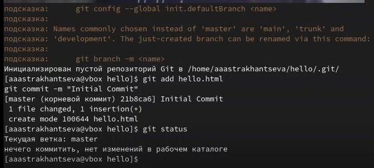{#fig:002 width=70%}

3. Внесение изменений 

Добавим кое-какие HTML-теги к нашему приветствию. Изменим содержимое файла hello.html на:
```
<h1>Hello, World!</h1>
```
Проверим состояние рабочего каталога.
```
git status
```

git знает, что файл hello.html был изменен, но при этом эти изменения еще не зафиксированы в репозитории.
Также обратим внимание на то, что сообщение о состоянии дает вам подсказку о том, что нужно делать дальше. Если нужно добавить эти изменения в репозиторий, используем команду git add. В противном случае используем команду
```
git сheckout
```
для отмены изменений.

4. Индексация изменений

Теперь выполним команду git, чтобы проиндексировать изменения. Проверим состояние.
```
git add hello.html
git status
```
Изменения файла hello.html были проиндексированы. Это означает, что git теперь знает об изменении, но изменение пока не записано в репозиторий. Следующий коммит будет включать в себя проиндексированные изменения (рис. [-@fig:003]).

{#fig:003 width=70%}

Сделаем коммит и проверим состояние.
```
git commit
git status
```
Рабочий каталог чистый, можно продолжить работу. Добавим стандартные теги страницы. Изменим страницу «Hello, World», чтобы она содержала стандартные теги <html> и <body>:
```
<html>
<body>
<h1>Hello, World!</h1>
</body>
</html>
```
Теперь добавим это изменение в индекс git.
```
git add hello.html
```
Теперь добавим заголовки HTML (секцию <head>) к странице «Hello, World»:
```
<html>
<head>
</head>
<body>
<h1>Hello, World!</h1>
</body>
</html>
```
Проверим текущий статус:
```
git status
```
Теперь hello.html указан дважды в состоянии. Первое изменение (добавление стандартных тегов) проиндексировано и готово к коммиту. Второе изменение (добавление заголовков HTML) является непроиндексированным (рис. [-@fig:004]).

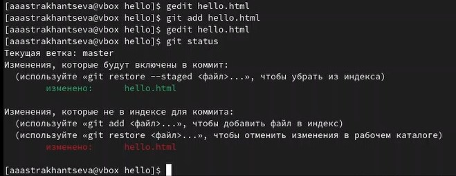{#fig:004 width=70%}

Получим список произведенных изменений: (рис. [-@fig:005])

```
git log 
```

{#fig:005 width=70%}

Еще различные методы для вывода истории в более удобном виде: (рис. [-@fig:006]).
```
git log --pretty=oneline
git log --pretty=oneline --max-count=2
git log --pretty=oneline --since='5 minutes ago'
git log --pretty=oneline --until='5 minutes ago'
git log --pretty=oneline --author=<your name>
git log --pretty=oneline --all
```
Справочную страницу можно посмотреть с помощью: 
```
man git-log
```

{#fig:006 width=70%}

Гит предоставляем возможность откатить проект к старой версии. Возвращаться назад в историю очень просто. Команда checkout скопирует любой снимок из репозитория в рабочий каталог. Получим хэши предыдущих версий
```
git log
```
Изучим данные лога и найдем хэш для первого коммита. Он должен быть в последней строке данных. Используем этот хэш-код (достаточно первых 7 знаков) в команде ниже. Затем проверим содержимое файла hello.html: (рис. [-@fig:007]). 
```
git checkout <hash>
cat hello.html
```

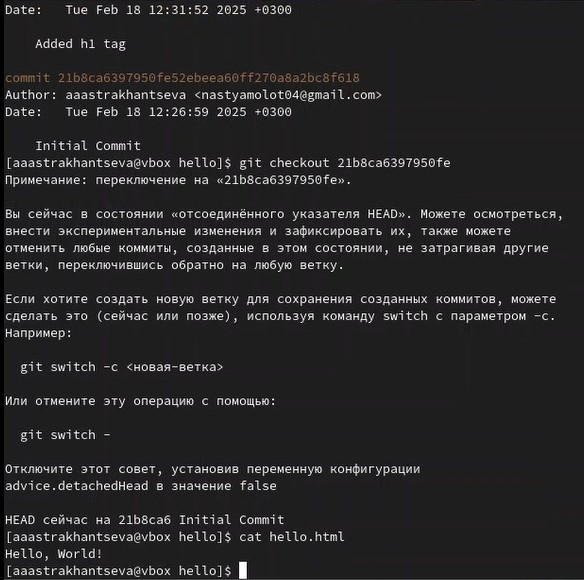{#fig:007 width=70%}

Давайте назовем текущую версию страницы hello первой (v1). Создадим тег первой версии
```
git tag v1
```

Теперь текущая версия страницы называется v1. Давайте создадим тег для версии, которая идет перед текущей версией и назовем его v1-beta. В первую очередь нам надо переключиться на предыдущую версию. Вместо поиска до хэш, мы будем использовать ^, обозначающее «родитель v1». Вместо обозначения v1^ можно использовать v1~1. Это обозначение можно определить как «первую версию предшествующую v1».
```
git checkout v1^
cat hello.html
```
Это версия c тегами <html> и <body>, но еще пока без <head>. Давайте сделаем ее версией v1-beta (рис. [-@fig:008]):
```
git tag v1-beta
```

{#fig:008 width=70%}

Теперь попробуем попереключаться между двумя отмеченными версиями.
```
git checkout v1
git checkout v1-beta
```

Можем увидеть, какие теги доступны, используя команду (рис. [-@fig:009]).:
```
git tag
```

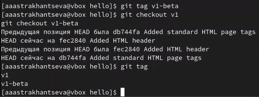{#fig:009 width=70%}

Можем посмотреть теги в логе (рис. [-@fig:010]).:
```
git log master --all
```
Можем видеть теги (v1 и v1-beta) в логе вместе с именем ветки (master). Кроме того HEAD показывает коммит, на который мы переключились (на данный момент это v1-beta).

{#fig:010 width=70%}

5. Отмена локальных изменений (до индексации)

Убедимся, что вы находимся на последнем коммите ветки master, прежде чем продолжить работу.
```
git checkout master
```
6. Отмена проиндексированных изменений (перед коммитом)

Внесем изменение в файл hello.html в виде нежелательного комментария:
```
<html>
<head>
</head>
<body>
<h1>Hello, World!</h1>
<!-- This is a bad comment. We want to revert it. -->
</body>
</html>
```

Проверим состояние рабочего каталога:
```
git status
```
Мы видим, что файл hello.html был изменен, но еще не проиндексирован. Используем команду git checkout для переключения версии файла:
```
hello.html в репозитории.
git checkout hello.html
git status
cat hello.html
```
Команда git status показывает нам, что не было произведено никаких изменений, не зафиксированных в рабочем каталоге.

Внесем изменение в файл hello.html в виде нежелательного комментария
```
<html>
<head>
<!-- This is an unwanted but staged comment -->
</head>
<body>
<h1>Hello, World!</h1>
</body>
</html>
```
Проиндексируем это изменение и проверим состоние: 
```
git add hello.html
git status
```
Состояние показывает, что изменение было проиндексировано и готово к коммиту. К счастью, вывод состояния показывает нам именно то, что мы должны сделать для отмены индексации изменения:
```
git reset HEAD hello.html
```
Команда git reset сбрасывает буферную зону к HEAD. Это очищает буферную зону от изменений, которые мы только что проиндексировали. Команда git reset (по умолчанию) не изменяет рабочий каталог. Поэтому рабочий каталог все еще содержит нежелательный комментарий. Мы можем использовать команду git checkout, чтобы удалить нежелательные изменения в рабочем каталоге (рис. [-@fig:011]).

{#fig:011 width=70%}

Переключимся на версию коммита: 
```
git checkout hello.html
git status
```
Наш рабочий каталог опять чист. 

7. Отмена коммитов

Иногда нужно отменить коммит, мы сделаем это путем создания нового коммита, отменяющего нежелательные изменения.
Изменим файл hello.html на следующий: 
```
<html>
<head>
</head>
<body>
<h1>Hello, World!</h1>
<!-- This is an unwanted but committed change -->
</body>
</html>
```
Выполним:
```
git add hello.html
git commit -m "Oops, we didn't want this commit"
```

Чтобы отменить коммит, нам необходимо сделать коммит, который удаляет изменения, сохраненные нежелательным коммитом.
```
git revert HEAD
```
Перейдем в редактор, где мы можем отредактировать коммит-сообщение по умолчанию или оставить все как есть. Сохраним и закроем файлТак как мы отменили самый последний произведенный коммит, мы смогли использовать HEAD в качестве аргумента для отмены. Мы можем отменить любой произвольной коммит в истории, указав его хэш-значение (рис. [-@fig:012]).

{#fig:012 width=70%}

8. Удаление коммитов из ветки

Давайте сделаем быструю проверку нашей истории коммитов. Выполним: 
```
git log
```
Мы видим, что два последних коммита в этой ветке — «Oops» и «Revert Oops». Давайте удалим их с помощью сброса.

Но прежде чем удалить коммиты, давайте отметим последний коммит тегом, чтобы потом можно было его найти.
```
git tag oops
```

Глядя на историю лога, мы видим, что коммит с тегом «v1» является коммитом, предшествующим ошибочному коммиту. Давайте сбросим ветку до этой точки. Поскольку ветка имеет тег, мы можем использовать имя тега в команде сброса
(если она не имеет тега, мы можем использовать хэш-значение).
```
git reset --hard v1
git log
```

Наша ветка master теперь указывает на коммит v1, а коммитов Oops и Revert Oops в ветке уже нет. Параметр --hard указывает, что рабочий каталог должен быть обновлен в соответствии с новым head ветки (рис. [-@fig:013]).

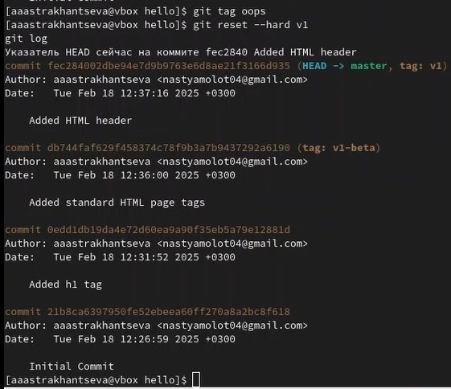{#fig:013 width=70%}

9. Удаление тега 

Тег oops свою функцию выполнил. Давайте удалим его и коммиты, на которые он ссылался, сборщиком мусора.
```
git tag -d oops
git log --all
```
Тег «oops» больше не будет отображаться в репозитории (рис. [-@fig:014]).

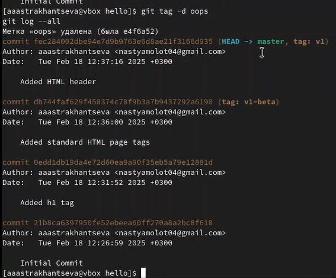{#fig:014 width=70%}

10. Внесение изменений в коммиты

Добавим в страницу комментарий автора: 
```
<!-- Author: Anastasiia A. Astrakhantseva -->
<html>
<head>
</head>
<body>
<h1>Hello, World!</h1>
</body>
</html>
```
Выполним:
```
git add hello.html
git commit -m "Add an author comment"
```

После совершения коммита мы понимаете, что любой хороший комментарий должен включать электронную почту автора. Обновим страницу hello, включив в нее email.
```
<!-- Author: Anastasiia A. Astrakhantseva (1132226437@pfur.ru) -->
<html>
<head>
</head>
<body>
<h1>Hello, World!</h1>
</body>
</html>
```

Мы действительно не хотим создавать отдельный коммит только ради электронной почты. Давайте изменим предыдущий коммит, включив в него адрес электронной почты. Выполним (рис. [-@fig:015]).
 
```
git add hello.html
git commit --amend -m "Add an author/email comment"
```
{#fig:015 width=70%}

11. Перемещение файлов

Сейчас мы собираемся создать структуру нашего репозитория. Давайте перенесем страницу в каталог lib.
```
mkdir lib
git mv hello.html lib
git status
```
Перемещая файлы с помощью git mv, мы информируем git о 2 вещах:
- Что файл hello.html был удален.
- Что файл lib/hello.html был создан.
- Оба эти факта сразу же проиндексированы и готовы к коммиту. Команда gitstatus сообщает, что файл был перемещен.

Давайте сделаем коммит этого перемещения:
```
git commit -m "Moved hello.html to lib"
```

Добавим файл index.html в наш репозиторий
```
<html>
<body>
<iframe src="lib/hello.html" width="200" height="200" />
</body>
</html>
```
Добавим файл и сделаем коммит (рис. [-@fig:016]):
```
git add index.html
git commit -m "Added index.html."
```
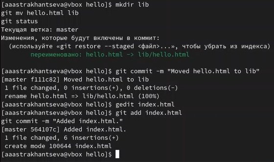{#fig:016 width=70%}

12. Git внутри: Каталог .git

Выполним: 
```
ls -C .git
```
Это каталог, в котором хранится вся информация git.
Выполним:
```
ls -C .git/objects
```
Мы должны увидеть набор каталогов, имена которых состоят из 2 символов. Имена каталогов являются первыми двумя буквами хэша sha1 объекта, хранящегося в git.
Выполним:
```
ls -C .git/objects/с6
```
Смотрим в один из каталогов с именем из 2 букв. Увидим файлы с именами из 38 символов. Это файлы, содержащие объекты, хранящиеся в git. Они сжаты и закодированы, поэтому просмотр их содержимого нам мало чем поможет.
Выполним:
```
cat .git/config
```
Это файл конфигурации, создающийся для каждого конкретного проекта. Записи в этом файле будут перезаписывать записи в файле .gitconfig вашего главного каталога, по крайней мере в рамках этого проекта (рис. [-@fig:017]):
```
ls .git/refs
```
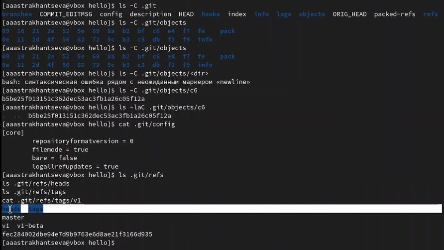{#fig:017 width=70%}

Выполним:
```
cat .git/HEAD
```
Файл HEAD содержит ссылку на текущую ветку, в данный момент это должна быть ветка master (рис. [-@fig:018]):

Выполним:
```
git log --max-count=1
```

13. Работа непосредственно с объектами git

Эта команда должна показать последний коммит в репозиторий: 

{#fig:018 width=70%}

Выполним:
```
git cat-file -t <hash>
git cat-file -p <hash>
```

Мы можем вывести дерево каталогов, ссылка на который идет в коммите. Это должно быть описание файлов (верхнего уровня) в нашем проекте (для конкретного коммита). Используйте SHA1 хэш из строки «дерева», из списка выше.

Выполним:
```
git cat-file -p <treehash>
```

Выполним:
```
git cat-file -p <libhash>
```
1.15.5 Вывод файла hello.html
Выполним:
```
git cat-file -p <hellohash>
```

Исследуем git репозиторий вручную самостоятельно. Смотрите, удастся ли вам найти оригинальный файл hello.html с самого первого коммита вручную по ссылкам SHA1 хэша в последнем коммите (рис. [-@fig:019], [-@fig:020]):

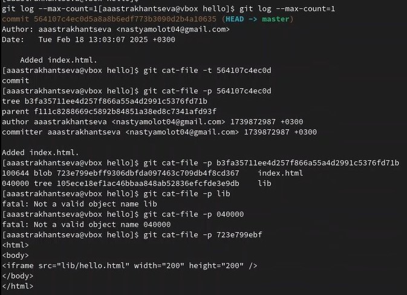{#fig:019 width=70%}
{#fig:020 width=70%}

14. Создание ветки 

Пора сделать наш hello world более выразительным. Так как это может занять некоторое время, лучше переместить эти изменения в отдельную ветку, чтобы изолировать их от изменений в ветке master. Давайте назовем нашу новую ветку «style».
Выполним:
```
git checkout -b style
git status
git checkout -b <имя_ветки> является шорткатом для git branch
```
Обратим внимание, что команда git status сообщает о том, что вы находитесь в ветке «style». Добавим файл стилей style.css
```
h1 {
color: red;
}
```

Выполним:
```
git add lib/style.css
git commit -m "Added css stylesheet"
Выполним:
```

Обновим файл hello.html, чтобы использовать стили style.css.
```
<!-- Author: Anastasiia A. Astrakhantseva (1132226437@pfur.ru) -->
<html>
<head>
<link type="text/css" rel="stylesheet"
media="all" href="style.css" />
18
</head>
<body>
<h1>Hello, World!</h1>
</body>
</html>
```
Выполним:
```
git add lib/hello.html
git commit -m "Hello uses style.css"
```

Обновим файл index.html, чтобы он тоже использовал style.css
```
<html>
<head>
<link type="text/css" rel="stylesheet"
media="all" href="lib/style.css" />
</head>
<body>
<iframe src="lib/hello.html" width="200" height="200" />
</body>
</html>
```
Выполним (рис. [-@fig:021]):
```
git add index.html
git commit -m "Updated index.html"
```
{#fig:021 width=70%}

15. Навигация по веткам

Теперь в проекте есть две ветки (рис. [-@fig:022])
Выполним:
```
git log --all
```
{#fig:022 width=70%}

Используем команду git checkout для переключения между ветками: 
```
git checkout master
cat lib/hello.html
```
Сейчас мы находимся на ветке master. Это заметно по тому, что файл hello.html не использует стили style.css.
Вернемся к ветке style. Выполним:
```
git checkout style
cat lib/hello.html
```
Содержимое lib/hello.html подтверждает, что мы вернулись на ветку style.

Пока вы меняли ветку style, кто-то решил обновить ветку master. Они добавили файл README.md.

Выполним:
```
git checkout master
echo "This is the Hello World example from the git tutorial." > README.md
```
Сделаем коммит изменений README.md в ветку master (рис. [-@fig:023]).
```
git add README.md
git commit -m "Added README"
```
{#fig:023 width=70%}

Теперь у нас в репозитории есть две отличающиеся ветки. Испольуем лог-команду для просмотра веток и их отличий (рис. [-@fig:024]). 
```
git log --graph --all
```
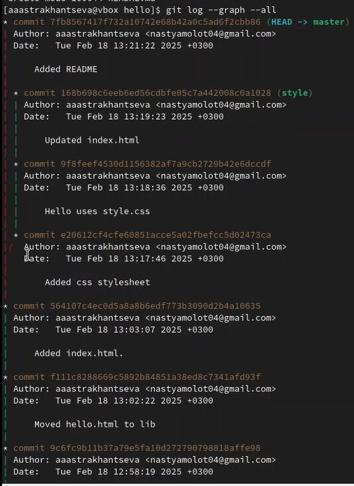{#fig:024 width=70%}

16. Слияние 

Слияние переносит изменения из двух веток в одну. Давайте вернемся к ветке style и сольем master с style (рис. [-@fig:025]). 
```
git checkout style
git merge master
git log --graph --all
```
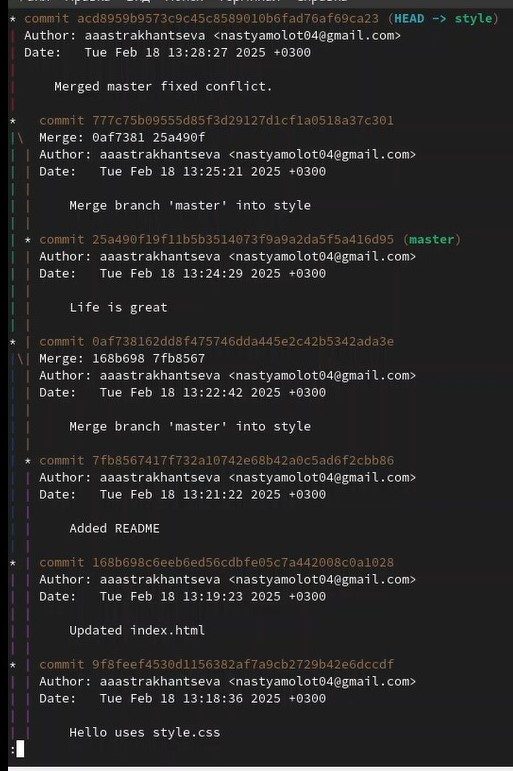{#fig:025 width=70%}

17. Сброс ветки 

Нам необходимо найти последний коммит перед слиянием (рис. [-@fig:026]). 
```
git checkout style
git log --graph
```
Мы видим, что коммит «Updated index.html» был последним на ветке style перед слиянием. Давайте сбросим ветку style к этому коммиту (рис. [-@fig:026]).
```
git reset --hard <hash>
```

{#fig:026 width=70%}

17. Перебазирование 

Используем команду rebase вместо команды merge. Мы вернулись в точку до первого слияния и хотим перенести изменения из ветки master в нашу ветку style. На этот раз для переноса изменений из ветки master мы будем использовать команду git rebase вместо слияния (рис. [-@fig:027]).
```
git checkout style
git rebase master
git log --graph
```
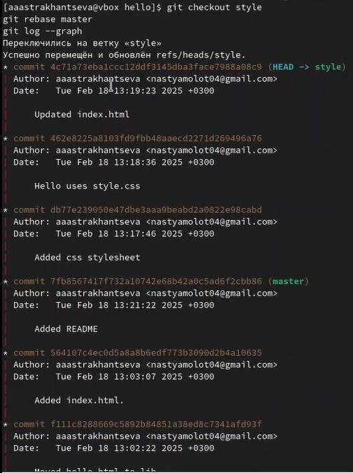{#fig:027 width=70%}

18. Клонирование репозиториев


Перейдем в рабочий каталог и сделаем клон репозитория hello.
```
cd ..
pwd
ls
```

Сейчас мы находимся в рабочем каталоге. В этот момент вы должны находиться в «рабочем» каталоге. Здесь должен быть единственный репозиторий под названием «hello». Создадим клон репозитория.
```
git clone hello cloned_hello
ls
```
В рабочем каталоге теперь должно быть два репозитория: оригинальный репозиторий «hello» и клонированный репозиторий «cloned_hello» 
Давайте взглянем на клонированный репозиторий (рис. [-@fig:028]).
```
cd cloned_hello
ls
```

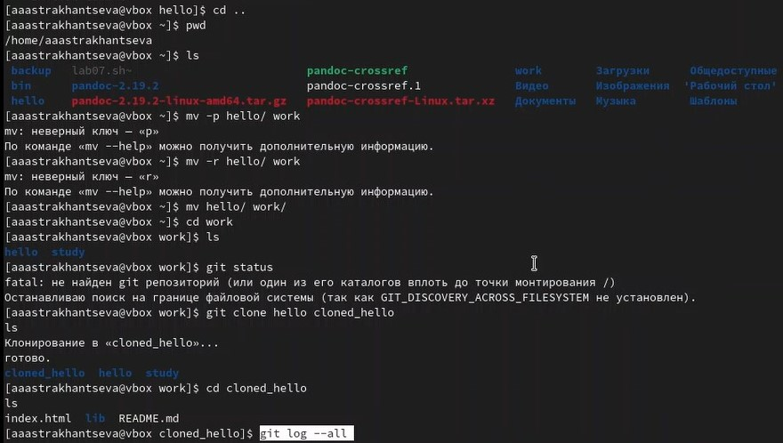{#fig:028 width=70%}

Просмотрим историю репозитория
```
git log --all
```
Увидим список всех коммитов в новый репозиторий, и он должен (более или менее) совпадать с историей коммитов в оригинальном репозитории. Единственная разница должна быть в названиях веток (рис. [-@fig:029]).

{#fig:029 width=70%}

19. Что такое origin?

Выполним:
```
git remote
```
Мы видим, что клонированный репозиторий знает об имени по умолчанию удаленного репозитория. Давайте посмотрим, можем ли мы получить более подробную информацию об имени по умолчанию:
```
git remote show origin
```
Удаленные репозитории обычно размещаются на отдельной машине, возможно, централизованном сервере. Однако, как мы видим здесь, они могут с тем же успехом указывать на репозиторий на той же машине. Нет ничего особенного в имени «origin», однако существует традиция использовать «origin» в качестве имени первичного централизованного репозитория (если таковой имеется).

Давайте посмотрим на ветки, доступные в нашем клонированном репозитории.
```
git branch
```
Как мы видим, в списке только ветка master. Где ветка style? Команда git branch выводит только список локальных веток по умолчанию.

Для того, чтобы увидеть все ветки, попробуем следующую команду:
```
git branch -a
```
Git выводит все коммиты в оригинальный репозиторий, но ветки в удаленном репозитории не рассматриваются как локальные. Если мы хотим собственную ветку style, мы должны сами ее создать. 

Внесем некоторые изменения в оригинальный репозиторий, чтобы затем попытаться извлечь и слить изменения из удаленной ветки в текущую

```
cd ../hello
```

Внесите следующие изменения в файл README.md (рис. [-@fig:030]).

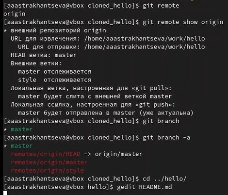{#fig:030 width=70%}
```
This is the Hello World example from the git tutorial.
```
Теперь добавьте это изменение и сделайте коммит
```
git add README
git commit -m "Changed README in original repo"
```

Теперь в оригинальном репозитории есть более поздние изменения, которых нет в клонированной версии. Далее мы извлечем и сольем эти изменения в клонированный репозиторий (рис. [-@fig:031]).

```
cd ../cloned_hello
git fetch
git log --all
```
{#fig:031 width=70%}

20. Слияние извлеченных изменений

Сольем извлеченные изменения в локальную ветку master (рис. [-@fig:031])
```
git merge origin/master
```
Еще раз провыерим файл README.md Сейчас мы должны увидеть изменения.

Теперь давайте рассмотрим объединение fetch и merge в одну команду. Выполним:
```
git pull
```
эквивалентно двум следующим шагам:
```
git fetch
git merge origin/master
```

21. Добавление ветки наблюдения

Ветки, которые начинаются с remotes/origin являются ветками оригинального репозитория. Обратите внимание, что у вас больше нет ветки под названием style, но система контроля версий знает, что в оригинальном репозитории ветка style была.
1.33.1 Добавьте локальную ветку, которая отслеживает удаленную ветку
```
git branch --track style origin/style
git branch -a
git log --max-count=2
```
Теперь мы можем видеть ветку style в списке веток и логе.
22.  Чистые репозитории
Чистые репозитории (без рабочих каталогов) обычно используются для расшаривания. Обычный git-репозиторий подразумевает, что вы будете использовать его как рабочую директорию, поэтому вместе с файлами проекта в актуальной версии, git хранит все служебные, «чисто-репозиториевские» файлы в поддиректории .git. В удаленных репозиториях нет смысла хранить рабочие файлы на диске (как это делается в рабочих копиях), а все что им действительно нужно — это дельты изменений и другие бинарные данные репозитория. Вот это и есть «чистый
репозиторий».
Создадим чистый репозиторий (рис. [-@fig:032]).
```
cd ..
git clone --bare hello hello.git
ls hello.git
```
{#fig:032 width=70%}

23. Отправка изменений 

Так как чистые репозитории, как правило, расшариваются на каком-нибудь сетевом сервере, нам необходимо отправить наши изменения в другие репозитории. Начнем с создания изменения для отправки. Отредактируйте файл README.md и
сделайте коммит. Файл README.md:
```
This is the Hello World example from the git tutorial.
(Changed in the original and pushed to shared)
```
Выполним:
```
git checkout master
git add README
git commit -m "Added shared comment to readme"
```
Теперь отправьте изменения в общий репозиторий.
Выполним:
```
git push shared master
```
Общим называется репозиторий, получающий отправленные нами изменения.
1.38 Извлечение общих изменений
Научиться извлекать изменения из общего репозитория. Быстро переключитесь в
клонированный репозиторий и извлеките изменения, только что отправленные в
общий репозиторий.
```
cd ../cloned_hello
```
Сейчас мы находимся в репозитории cloned_hello.
Выполните:

```git remote add shared ../hello.git
git branch --track shared master
git pull shared master
cat README.md
```

# Выводы

В ходе выполнения лабораторной работы я приобрела навыки работы с git и markdown.

