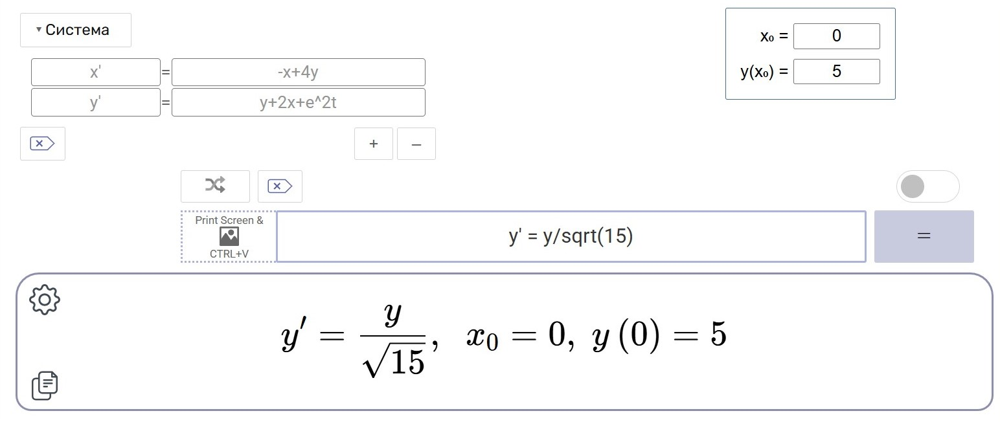
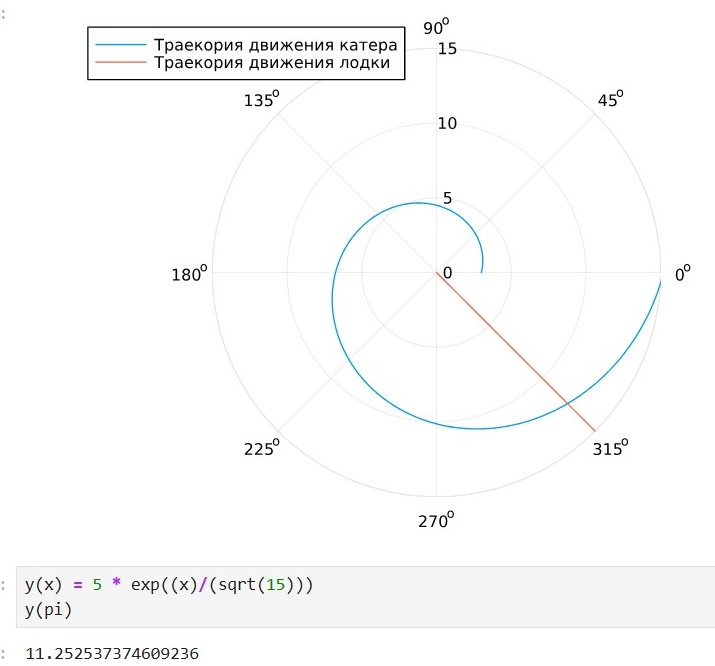
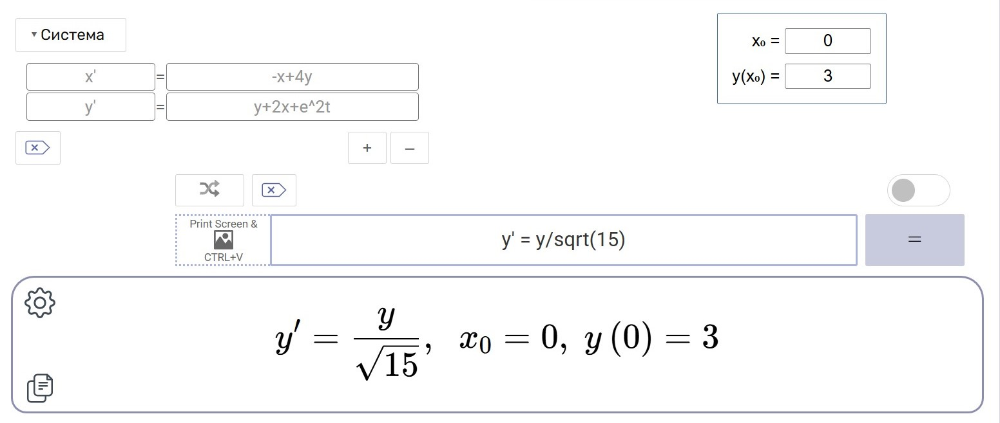

---
## Front matter
lang: ru-RU
title: "Лабораторная работа №2"
subtitle: "Задача о погоне"
author: 
  - Астраханцева А. А.
institute:
  - Российский университет дружбы народов, Москва, Россия
date: 8 марта 2025

## i18n babel
babel-lang: russian
babel-otherlangs: english

## Formatting pdf
toc: false
toc-title: Содержание
slide_level: 2
aspectratio: 169
section-titles: true
theme: metropolis
header-includes:
 - \metroset{progressbar=frametitle,sectionpage=progressbar,numbering=fraction}
---

# Информация

## Докладчик

:::::::::::::: {.columns align=center}
::: {.column width="70%"}

  * Астраханцева Анастасия Александровна
  * НФИбд-01-22, 1132226437
  * Российский университет дружбы народов
  * [1132226437@pfur.ru](mailto:1132226437@pfur.ru)
  * <https://github.com/aaastrakhantseva>

:::
::: {.column width="30%"}


:::
::::::::::::::

# Вводная часть

## Цели лабораторной работы

Построить математическую модель для выбора правильной стратегии при решении задач поиска.

# Выполнение ЛР

## Номер варианта

Для начала надо определить номер варианта:
```
(1132226437%70)+1
```

## Вариант 28

k=15, известно, что скорость катера в 4 раза больше скорости браконьерской лодки.
1. Запишите уравнение, описывающее движение катера, с начальными
условиями для двух случаев (в зависимости от расположения катера
относительно лодки в начальный момент времени).
2. Постройте траекторию движения катера и лодки для двух случаев.
3. Найдите точку пересечения траектории катера и лодки

## Расстояние х 

Тогда неизвестное расстояние x можно найти из следующего уравнения:

$$
\dfrac {x} {v} = \dfrac {15-x} {4v}
$$

в первом случае или
$$
\dfrac {x} {v} = \dfrac {15+x} {4v}
$$

## Значения $x_1, x_2$

$$
x_1 = 3, x_2 = 5
$$
Тангенциальное ускорение:
$$
v_{\tau} = \sqrt{(4v)^2 - v^2}
$$

$$
v_{\tau} = \sqrt{16 v^2 - v^2} = \sqrt{15v^2} = v\sqrt{15}
$$

## Система ДУ

$$
\begin{cases}
&\dfrac{dr} {dt} = v\\
&r\dfrac{d \theta} {dt} = v\sqrt{15}
\end{cases}
$$

## Начальные условия

$$
\begin{cases}
&{\theta}_0 = 0\\
&r_0 = 3
\end{cases}
$$

Или

$$
\begin{cases}
&{\theta}_0 = -\pi \\
&r_0 = 5
\end{cases}
$$

## Конечное ДУ

$$
\dfrac{dr}{d \theta} = \dfrac{r}{\sqrt{15}}
$$

## Разбор кода

```
r0 = 3
r0_2 = 5
theta0 = (0, 2*pi) 
theta0_2 = (-pi, pi)

# данные для движения лодки браконьеров

fi = 3*pi/4;
t = (0, 50);

```

## Разбор кода

```

# функция, описывающая движение лодки браконьеров

x(t) = tan(fi)*t;

# функция, описывающая движение катера береговой охраны

f(r, p, t) = r/sqrt(15)

# постановка проблемы и решение ДУ для 1 случая

prob = ODEProblem(f, r0, theta0)

sol = solve(prob, saveat = 0.01)

```

## Разбор кода


```

# отрисовка траектории движения катера

plot(sol.t, sol.u, proj=:polar, lims=(0, 15), label = "Траекория движения катера")
```
Далее строим еще траекторию движения лодки

```
ugol = [fi for i in range(0,15)]

x_lims = [x(i) for i in range(0,15)]

# отрисовка траектории движения лодки вместе с катером

plot!(ugol, x_lims, proj=:polar, lims=(0, 15), label = "Траекория движения лодки")

```


## График

{#fig:001 width=70%}

## Решение ДУ

{#fig:002 width=70%}

## Решение ДУ

{#fig:003 width=70%}

## Второй случай

```
# постановка проблемы и решение ДУ для 1 случая

prob = ODEProblem(f, r0, theta0)

sol = solve(prob, saveat = 0.01)

# отрисовка траектории движения катера

plot(sol.t, sol.u, proj=:polar, lims=(0, 15), label = "Траекория движения катера")
ugol = [fi for i in range(0,15)]

x_lims = [x(i) for i in range(0,15)]

# отрисовка траектории движения лодки вместе с катером

plot!(ugol, x_lims, proj=:polar, lims=(0, 15), label = "Траекория движения лодки")
```

## График

{#fig:004 width=70%}

## Решение ДУ

{#fig:005 width=70%}

## Решение ДУ

{#fig:006 width=70%}


# Выводы

В ходе выполнения лабораторной работы я построила математическую модель для выбора правильной стратегии при решении задач поиска.


# Спасибо за внимание!
