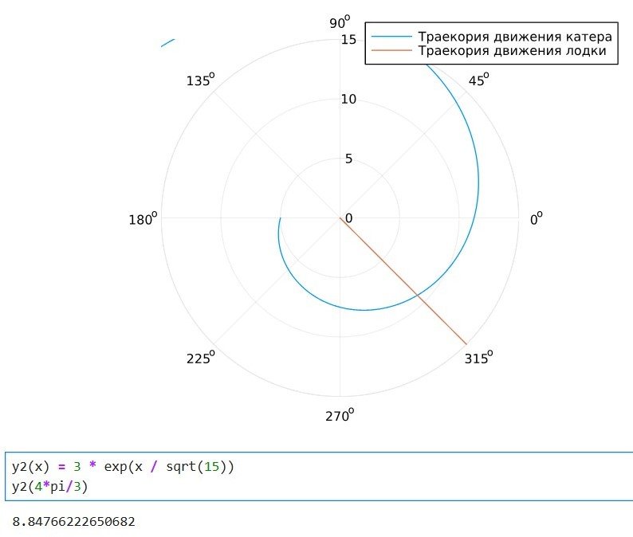
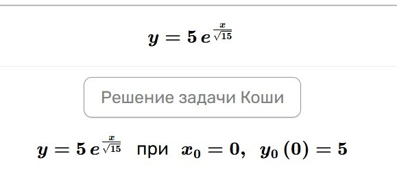

---
## Front matter
title: "Лабораторная работа №2"
subtitle: "Задача о погоне"
author: "Астраханцева А. А."

## Generic otions
lang: ru-RU
toc-title: "Содержание"

## Bibliography
bibliography: bib/cite.bib
csl: pandoc/csl/gost-r-7-0-5-2008-numeric.csl

## Pdf output format
toc: true # Table of contents
toc-depth: 2
lof: true # List of figures
lot: false # List of tables
fontsize: 12pt
linestretch: 1.5
papersize: a4
documentclass: scrreprt
## I18n polyglossia
polyglossia-lang:
  name: russian
  options:
	- spelling=modern
	- babelshorthands=true
polyglossia-otherlangs:
  name: english
## I18n babel
babel-lang: russian
babel-otherlangs: english
## Fonts
mainfont: PT Serif
romanfont: PT Serif
sansfont: PT Sans
monofont: PT Mono
mainfontoptions: Ligatures=TeX
romanfontoptions: Ligatures=TeX
sansfontoptions: Ligatures=TeX,Scale=MatchLowercase
monofontoptions: Scale=MatchLowercase,Scale=0.9
## Biblatex
biblatex: true
biblio-style: "gost-numeric"
biblatexoptions:
  - parentracker=true
  - backend=biber
  - hyperref=auto
  - language=auto
  - autolang=other*
  - citestyle=gost-numeric
## Pandoc-crossref LaTeX customization
figureTitle: "Рис."
tableTitle: "Таблица"
listingTitle: "Листинг"
lofTitle: "Список иллюстраций"
lotTitle: "Список таблиц"
lolTitle: "Листинги"
## Misc options
indent: true
header-includes:
  - \usepackage{indentfirst}
  - \usepackage{float} # keep figures where there are in the text
  - \floatplacement{figure}{H} # keep figures where there are in the text
---

# Цель работы

Построить математическую модель для выбора правильной стратегии при решении задач поиска.

# Выполнения ЛР

Для начала надо определить номер варианта:
```
(1132226437%70)+1
```

**Вариант 28**

На море в тумане катер береговой охраны преследует лодку браконьеров.
Через определенный промежуток времени туман рассеивается, и лодка
обнаруживается на расстоянии 15 км от катера. Затем лодка снова скрывается в
тумане и уходит прямолинейно в неизвестном направлении. Известно, что скорость
катера в 4 раза больше скорости браконьерской лодки.
1. Запишите уравнение, описывающее движение катера, с начальными
условиями для двух случаев (в зависимости от расположения катера
относительно лодки в начальный момент времени).
2. Постройте траекторию движения катера и лодки для двух случаев.
3. Найдите точку пересечения траектории катера и лодки

Тогда неизвестное расстояние x можно найти из следующего уравнения:

$$
\dfrac {x} {v} = \dfrac {k-x} {4v}
$$

в первом случае или
$$
\dfrac {x} {v} = \dfrac {k+x} {4v}
$$

во втором. Подставим k=15: 

$$
\dfrac {x} {v} = \dfrac {15-x} {4v}
$$

в первом случае или
$$
\dfrac {x} {v} = \dfrac {15+x} {4v}
$$
Отсюда мы найдем два значения
$$
x_1 = 3, x_2 = 5
$$
Тангенциальное ускорение:
$$
v_{\tau} = \sqrt{(4v)^2 - v^2}
$$

$$
v_{\tau} = \sqrt{16 v^2 - v^2} = \sqrt{15v^2} = v\sqrt{15}
$$
Получим систему уравнений

$$
\begin{cases}
&\dfrac{dr} {dt} = v\\
&r\dfrac{d \theta} {dt} = v\sqrt{15}
\end{cases}
$$

С начальными условиями:

$$
\begin{cases}
&{\theta}_0 = 0\\
&r_0 = 3
\end{cases}
$$

Или

$$
\begin{cases}
&{\theta}_0 = -\pi \\
&r_0 = 5
\end{cases}
$$

Исключая из полученной системы производную по $t$, можно перейти к следующему уравнению:

$$
\dfrac{dr}{d \theta} = \dfrac{r}{\sqrt{15}}
$$

Код, написанный для данной ЛР:

```
r0 = 3
r0_2 = 5
theta0 = (0, 2*pi) 
theta0_2 = (-pi, pi)

# данные для движения лодки браконьеров

fi = 3*pi/4;
t = (0, 50);

# функция, описывающая движение лодки браконьеров

x(t) = tan(fi)*t;

# функция, описывающая движение катера береговой охраны

f(r, p, t) = r/sqrt(15)

# постановка проблемы и решение ДУ для 1 случая

prob = ODEProblem(f, r0, theta0)

sol = solve(prob, saveat = 0.01)

# отрисовка траектории движения катера

plot(sol.t, sol.u, proj=:polar, lims=(0, 15), label = "Траекория движения катера")
```
Далее строим еще траекторию движения лодки

```
ugol = [fi for i in range(0,15)]

x_lims = [x(i) for i in range(0,15)]

# отрисовка траектории движения лодки вместе с катером

plot!(ugol, x_lims, proj=:polar, lims=(0, 15), label = "Траекория движения лодки")

```

Получаем такой график: (рис. [-@fig:001]).

{#fig:001 width=70%}

с помощью онлайн калькулятора найдем точку пересечения двух траекторий (рис. [-@fig:002] - [-@fig:003])

{#fig:002 width=70%}

{#fig:003 width=70%}

Далее рассматриваем второй случай.

```
# постановка проблемы и решение ДУ для 1 случая

prob = ODEProblem(f, r0, theta0)

sol = solve(prob, saveat = 0.01)

# отрисовка траектории движения катера

plot(sol.t, sol.u, proj=:polar, lims=(0, 15), label = "Траекория движения катера")
ugol = [fi for i in range(0,15)]

x_lims = [x(i) for i in range(0,15)]

# отрисовка траектории движения лодки вместе с катером

plot!(ugol, x_lims, proj=:polar, lims=(0, 15), label = "Траекория движения лодки")
```
Получаем такой график: (рис. [-@fig:004]).

{#fig:004 width=70%}

с помощью онлайн калькулятора найдем точку пересечения двух траекторий (рис. [-@fig:005] - [-@fig:006])

{#fig:005 width=70%}

{#fig:006 width=70%}


# Выводы

В ходе выполнения лабораторной работы я построила математическую модель для выбора правильной стратегии при решении задач поиска.

