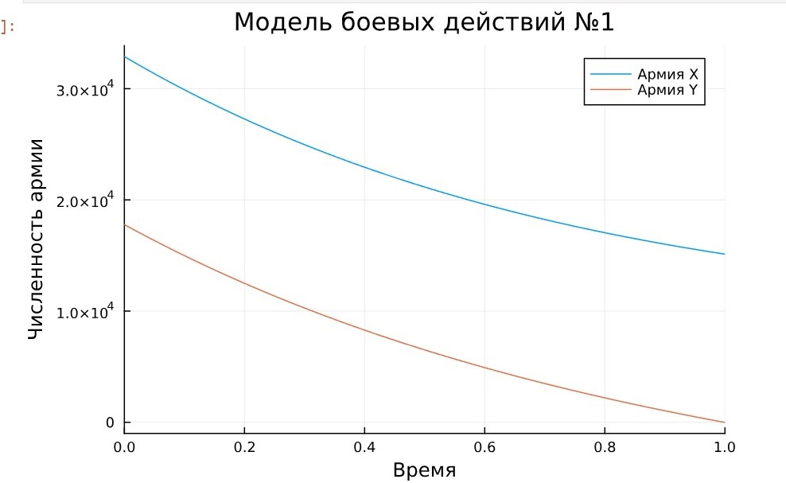
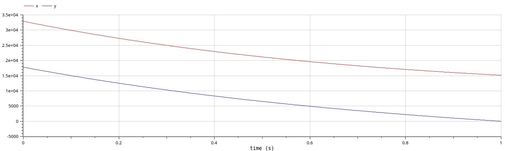
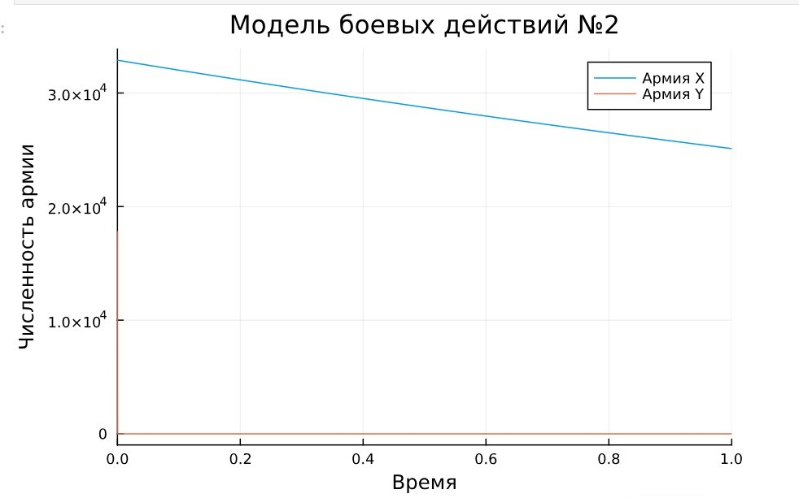
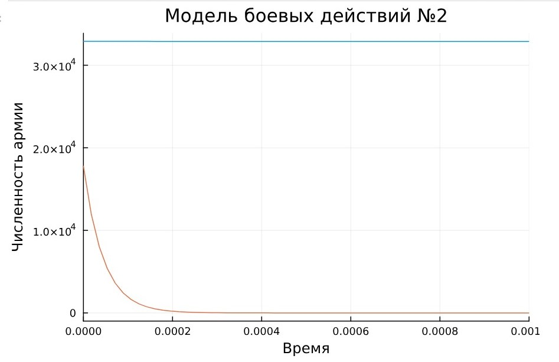
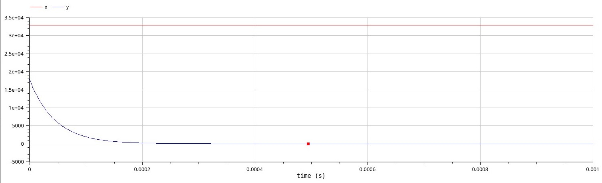

---
## Front matter
lang: ru-RU
title: "Лабораторная работа №3"
subtitle: "Модель боевых действий"
author: 
  - Астраханцева А. А.
institute:
  - Российский университет дружбы народов, Москва, Россия
date: 21 марта 2025

## i18n babel
babel-lang: russian
babel-otherlangs: english

## Formatting pdf
toc: false
toc-title: Содержание
slide_level: 2
aspectratio: 169
section-titles: true
theme: metropolis
header-includes:
 - \metroset{progressbar=frametitle,sectionpage=progressbar,numbering=fraction}
---

# Информация

## Докладчик

:::::::::::::: {.columns align=center}
::: {.column width="70%"}

  * Астраханцева Анастасия Александровна
  * НФИбд-01-22, 1132226437
  * Российский университет дружбы народов
  * [1132226437@pfur.ru](mailto:1132226437@pfur.ru)
  * <https://github.com/aaastrakhantseva>

:::
::: {.column width="30%"}


:::
::::::::::::::

# Вводная часть

## Цели лабораторной работы

Построить модель боевых действий на языке прогаммирования Julia и посредством ПО OpenModelica.

# Выполнение ЛР

## Номер варианта

Для начала надо определить номер варианта:
```
(1132226437%70)+1
```

## Вариант 28

1. Модель боевых действий между регулярными войсками
$$\begin{cases}
    \dfrac{dx}{dt} = -0.55x(t)- 0.77y(t)+1.5sin(3t+1)\\
    \dfrac{dy}{dt} = -0.66x(t)- 0.44y(t)+1.2cos(t+1)
\end{cases}$$


## Разбор кода

```
# используемые библиотеки
using DifferentialEquations, Plots;

# задание системы дифференциальных уравнений, описывающих модель 
# боевых действий между регулярными войсками
function reg(u, p, t)
    x, y = u
    a, b, c, h = p
    dx = -a*x - b*y+1.5sin(3t+1)
    dy = -c*x -h*y+1.2cos(t+1)
    return [dx, dy]
end

```

## Разбор кода

```

# начальные условия
u0 = [32888, 17777]
p = [0.55, 0.77, 0.66, 0.44]
tspan = (0,1)

# постановка проблемы
prob = ODEProblem(reg, u0, tspan, p)

# решение системы ДУ
sol = solve(prob, Tsit5())

# построение графика, который описывает изменение численности армий
plot(sol, title = "Модель боевых действий №1",  label = ["Армия X" "Армия Y"], xaxis = "Время", yaxis = "Численность армии")

```


## График

{#fig:001 width=70%}

## Модель в OpenModelica

```OpenModelica
model lab3_model
  parameter Real a = 0.55;
  parameter Real b = 0.77;
  parameter Real c = 0.66;
  parameter Real h = 0.44;
  parameter Real x0 = 32888;
  parameter Real y0 = 17777;
  Real x(start=x0);
  Real y(start=y0);
equation
  der(x) = -a*x - b*y+1.5*sin(3*time+1);
  der(y) = -c*x -h*y+1.2*cos(time+1);
end lab3_model;
```

## График

{#fig:002 width=70%}

## Второй случай

2. Модель ведение боевых действий с участием регулярных войск и партизанских отрядов

$$\begin{cases}
    \dfrac{dx}{dt} = -0.27x(t)-0.88y(t)+sin(20t)\\
    \dfrac{dy}{dt} = -0.68x(t)y(t)-0.37y(t)+cos(10t+1)
\end{cases}$$

## Разбор кода

```
# задание системы дифференциальных уравнений, описывающих модель 
# боевых действий с участием регулярных войск и партизанских отрядов
function reg_part(u, p, t)
    x, y = u
    a, b, c, h = p
    dx = -a*x - b*y+sin(20*t)
    dy = -c*x*y -h*y+cos(10*t+1)
    return [dx, dy]
end
```

## Разбор кода

```
# начальные условия
u0 = [32888, 17777]
p = [0.27, 0.88, 0.68, 0.37]
tspan = (0,1)\

# постановка проблемы
prob2 = ODEProblem(reg_part, u0, tspan, p)

# решение системы ДУ
sol2 = solve(prob2, Tsit5())

# построение графика, который описывает изменение численности армий
plot(sol2, title = "Модель боевых действий №2", label = ["Армия X" "Армия Y"], xaxis = "Время", yaxis = "Численность армии")
```


## График

{#fig:003 width=70%}

## Уменьшение временного промежутка

```Julia
plot(sol2, title = "Модель боевых действий №2", label = false, xaxis = "Время", yaxis = "Численность армии", xlimit = [0,0.001])

```

## График

{#fig:004 width=70%}

## Модель в OpenModelica

```
model lab3_model2
  parameter Real a = 0.27;
  parameter Real b = 0.88;
  parameter Real c = 0.68;
  parameter Real h = 0.37;
  parameter Real x0 = 32888;
  parameter Real y0 = 17777;
  Real x(start=x0);
  Real y(start=y0);
equation
  der(x) = -a*x - b*y + sin(20*time);
  der(y) = -c*x*y - h*y + cos(10*time) + 1;
end lab3_model2;
```


## График

{#fig:005 width=70%}


# Выводы

В процессе выполнения данной лабораторной работы я построила модель боевых действий на языке программирования Julia и посредством ПО OpenModelica, а также провела сравнительный анализ.
