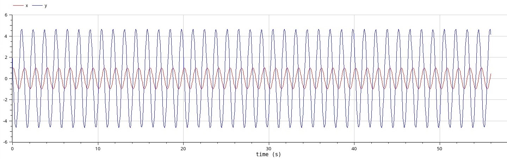
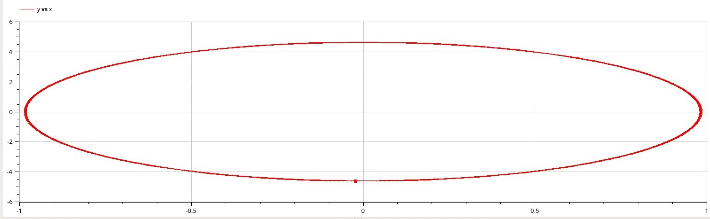
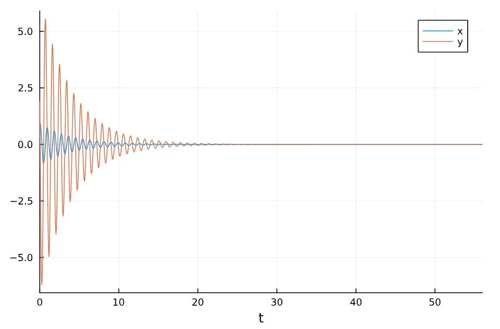
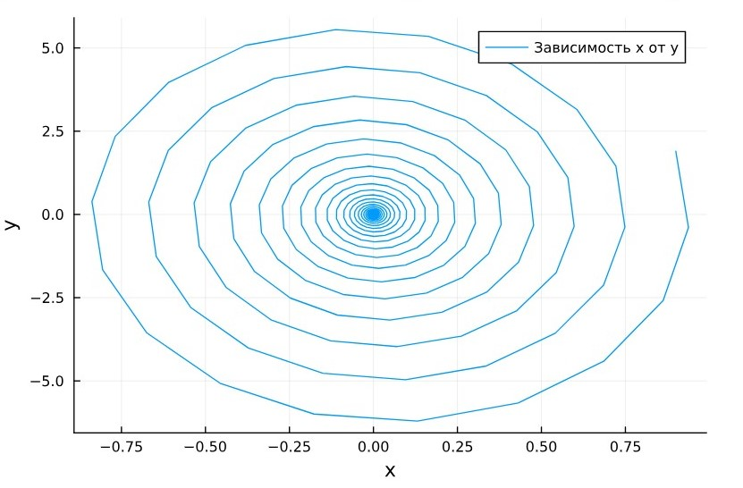
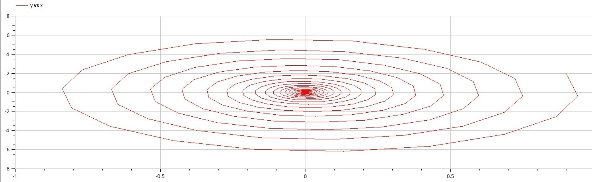
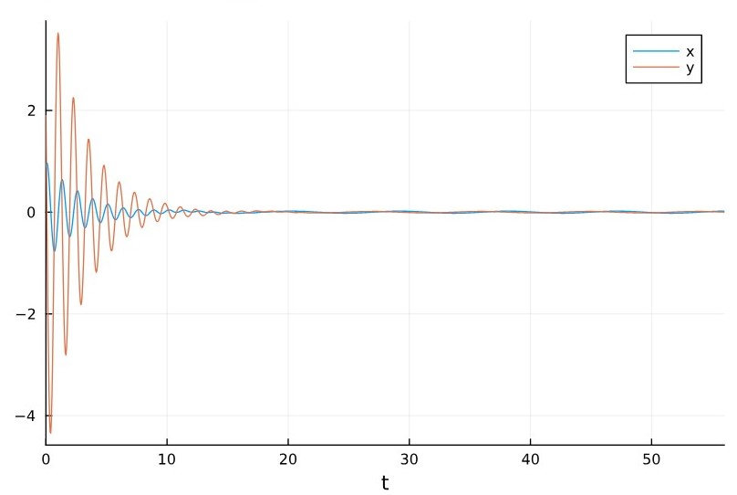

---
## Front matter
lang: ru-RU
title: "Лабораторная работа №4"
subtitle: "Модель гармонических колебаний"
author: 
  - Астраханцева А. А.
institute:
  - Российский университет дружбы народов, Москва, Россия
date: 5 апреля 2025

## i18n babel
babel-lang: russian
babel-otherlangs: english

## Formatting pdf
toc: false
toc-title: Содержание
slide_level: 2
aspectratio: 169
section-titles: true
theme: metropolis
header-includes:
 - \metroset{progressbar=frametitle,sectionpage=progressbar,numbering=fraction}
---

# Информация

## Докладчик

:::::::::::::: {.columns align=center}
::: {.column width="70%"}

  * Астраханцева Анастасия Александровна
  * НФИбд-01-22, 1132226437
  * Российский университет дружбы народов
  * [1132226437@pfur.ru](mailto:1132226437@pfur.ru)
  * <https://github.com/aaastrakhantseva>

:::
::: {.column width="30%"}


:::
::::::::::::::

# Вводная часть

## Цели лабораторной работы

Построить математическую модель гармонического осциллятора.

# Выполнение ЛР

## Номер варианта

Для начала надо определить номер варианта:
```
(1132226437%70)+1
```

## Вариант 28

1. Колебания гармонического осциллятора без затуханий и без действий внешней силы $\ddot{x} + 4.7x = 0$

2. Колебания гармонического осциллятора c затуханием и без действий внешней $\ddot{x} + 0.5 \dot{x} + 7x = 0$

3. Колебания гармонического осциллятора c затуханием и под действием внешней силы $\ddot{x} + 7 \dot{x} + 0.5x = 0.5 \sin{0.7t}$

На интервале $t \in [0; 56]$ (шаг 0.05) с начальными условиями $x_0 = 0.9, y_0 = 1.9$


## Разбор кода

```
using DifferentialEquations, Plots;
tspan = (0,56)
u0 = [0.9, 1.9]
p1 = [0, 4.7]
function f1(u, p, t)
    x, y = u
    g, w = p
    dx = y
    dy = -g .*y - w^2 .*x
    return [dx, dy]
end
problem1 = ODEProblem(f1, u0, tspan, p1)
sol1 = solve(problem1, Tsit5(), saveat = 0.05)


```


## Колебания гармонического осциллятора без затуханий и без действий внешней силы

[Колебания гармонического осциллятора без затуханий и без действий внешней силы](image/1.jpg){#fig:001 width=70%}

## Фазовый портрет колебаний гармонического осциллятора без затуханий и без действий внешней силы

{#fig:002 width=70%}

## Модель в OpenModelica

```OpenModelica
model lab4_1
  parameter Real g = 0;
  parameter Real w = 4.7;
  parameter Real x0 = 0.9;
  parameter Real y0 = 1.9;
  Real x(start=x0);
  Real y(start=y0);
equation
    der(x) = y;
    der(y) = -g .*y - w^2 .*x;
end lab4_1;
```

## Колебания гармонического осциллятора без затуханий и без действий внешней силы. OpenModelica

{#fig:003 width=70%}

## Фазовый портрет колебаний гармонического осциллятора без затуханий и без действий внешней силы. OpenModelica

{#fig:004 width=70%}

## Модель колебаний гармонического осциллятора c затуханием и без действий внешней силы 


Колебания гармонического осциллятора c затуханием и без действий внешней $\ddot{x} + 0.5 \dot{x} + 7x = 0$

## Разбор кода

```
p2 = [0.5, 7]

function f1(u, p, t)
    x, y = u
    g, w = p
    dx = y
    dy = -g .*y - w^2 .*x
    return [dx, dy]
end

problem2 = ODEProblem(f1, u0, tspan, p2)
sol2 = solve(problem2, Tsit5(), saveat = 0.05)
```


## Колебания гармонического осциллятора с затуханием и без действий внешней силы

{#fig:005 width=70%}

## Фазовый портрет колебаний гармонического осциллятора с затуханием и без действий внешней силы

{#fig:006 width=70%}


## Модель в OpenModelica

```
model lab4_2
  parameter Real g = 0.5;
  parameter Real w = 7;
  parameter Real x0 = 0.9;
  parameter Real y0 = 1.9;
  Real x(start=x0);
  Real y(start=y0);
equation
    der(x) = y;
    der(y) = -g .*y - w^2 .*x;
end lab4_2;
```


## Колебания гармонического осциллятора с затуханием и без действий внешней силы. OpenModelica

{#fig:007 width=70%}

## Фазовый портрет колебаний гармонического осциллятора с затуханием и без действий внешней силы. OpenModelica

{#fig:008 width=70%}

## Модель колебаний гармонического осциллятора c затуханием и под действием внешней силы

3. Колебания гармонического осциллятора c затуханием и под действием внешней силы $\ddot{x} + 7 \dot{x} + 0.5x = 0.5 \sin{0.7t}$


## Разбор кода

```Julia

# Начальные условия

p3 = [0.7, 5]
f(t) = 0.5*sin(0.7*t)

# Задание функции
function f2(u, p, t)
    x, y = u
    g, w = p
    dx = y
    dy = -g .*y - w^2 .*x .+f(t)
    return [dx, dy]
end

problem3 = ODEProblem(f2, u0, tspan, p3)
sol3 = solve(problem3, Tsit5(), saveat = 0.05)

```

## Колебания гармонического осциллятора с затуханием и под действием внешней силы

{#fig:009 width=70%}

## Фазовый портрет колебаний гармонического осциллятора с затуханием и под действием внешней силы

{#fig:010 width=70%}

## Модель в OpenModelica.

```
model lab4_3
  parameter Real g = 0.7;
  parameter Real w = 5;
  parameter Real x0 = 0.9;
  parameter Real y0 = 1.9;
  Real x(start=x0);
  Real y(start=y0);
equation
    der(x) = y;
    der(y) = -g .*y - w^2 .*x + 0.5*sin(0.7*time);
end lab4_3;
```

## Колебания гармонического осциллятора с затуханием и под действием внешней силы. OpenModelica

{#fig:011 width=70%}

## Фазовый портрет колебаний гармонического осциллятора с затуханием и под действием внешней силы. OpenModelica

{#fig:012 width=70%}

В третьем случае графики, полученные с помощью OpenModelica и Julia все также идентичны.

# Выводы

В процессе выполнения данной лабораторной работы я построила математическую модель гармонического осциллятора.


