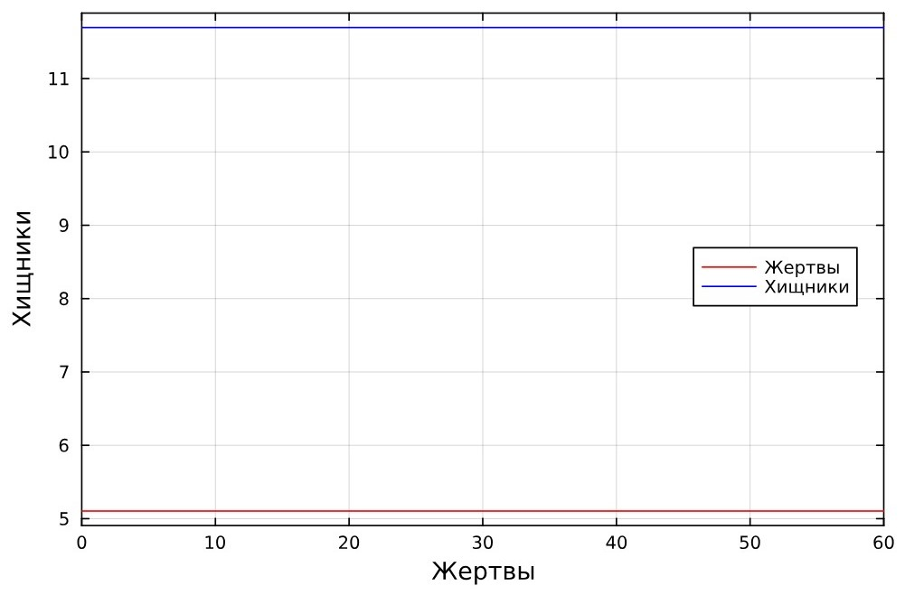
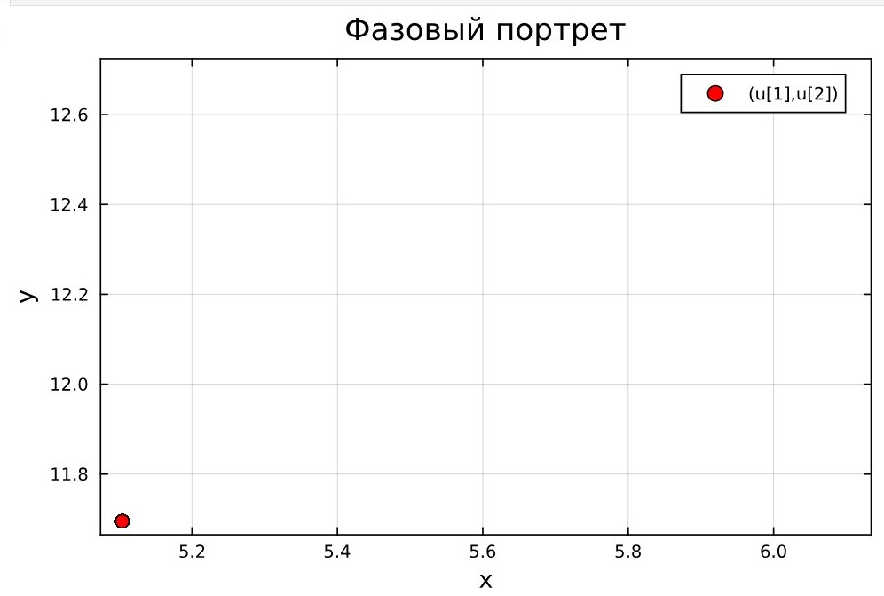
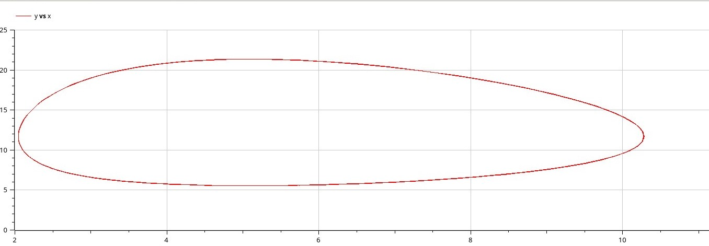

---
## Front matter
lang: ru-RU
title: "Лабораторная работа №5"
subtitle: "Модель хищник-жертва"
author: 
  - Астраханцева А. А.
institute:
  - Российский университет дружбы народов, Москва, Россия
date: 19 апреля 2025


## i18n babel
babel-lang: russian
babel-otherlangs: english

## Formatting pdf
toc: false
toc-title: Содержание
slide_level: 2
aspectratio: 169
section-titles: true
theme: metropolis
header-includes:
 - \metroset{progressbar=frametitle,sectionpage=progressbar,numbering=fraction}
 - '\makeatletter'
 - '\beamer@ignorenonframefalse'
 - '\makeatother'
---

# Информация

## Докладчик

:::::::::::::: {.columns align=center}
::: {.column width="70%"}

  * Астраханцева Анастасия Александровна
  * НФИбд-01-22, 1132226437
  * Российский университет дружбы народов
  * [1132226437@pfur.ru](mailto:1132226437@pfur.ru)
  * <https://github.com/aaastrakhantseva>

:::
::: {.column width="30%"}


:::
::::::::::::::

# Вводная часть

## Цели и задачи

Исследовать математическую модель Лотки-Вольерры.

## Задание

Для модели «хищник-жертва»:

$$\begin{cases}
    &\dfrac{dx}{dt} = - 0.69 x(t) + 0.059 x(t)y(t) \\
    &\dfrac{dy}{dt} = 0.49 y(t) - 0.096 x(t)y(t)
\end{cases}$$

Построить график зависимости численности хищников от численности жертв,
а также графики изменения численности хищников и численности жертв при
следующих начальных условиях: $x_0 = 8, y_0 = 19$. 
Найти стационарное состояние системы.

# Выполнение работы

## Выполнение лабораторной работы. Julia

```Julia

# Используемые библиотеки
using DifferentialEquations, Plots;

# задания системы ДУ, описывающей модель Лотки-Вольтерры
function LV(u, p, t)
    x, y = u
    a, b, c, d = p
    dx = a*x - b*x*y
    dy = -c*y + d*x*y
    return [dx, dy]
end

```

## Выполнение лабораторной работы. Julia

```Julia
# Начальные условия
u0 = [8,19]
p = [-0.69, -0.059, -0.49, -0.096]
tspan = (0.0, 60.0)
prob = ODEProblem(LV, u0, tspan, p)
sol = solve(prob, Tsit5())

# Постановка проблемы и ее решение
plot(sol, title = "Модель Лотки-Вольтерры", xaxis = "Время", 
    yaxis = "Численность популяции", 
    label = ["жертвы" "хищники"], 
    c = ["red" "blue"], box =:on)
```

## Выполнение лабораторной работы. Julia

{#fig:001 width=50%}

## Выполнение лабораторной работы. Julia

{#fig:002 width=50%}

## Выполнение лабораторной работы. Julia

Далее найдем стационарное состояние системы по формуле:

$$\begin{cases}
  &x_0 = \dfrac{\gamma}{\delta}\\
  &y_0 = \dfrac{\alpha}{\beta}
\end{cases}
$$

## Выполнение лабораторной работы. Julia

```Julia
function find_stat(p)
    a,b,c,d = p
    x0 = c/d
    y0 = a/b
    return x0,y0
end

x0, y0 = find_stat(p)
u2 = [x0, y0]
print("x0 = ", x0, "y0 = ", y0)
prob2 = ODEProblem(LV, u2, tspan, p)
sol2 = solve(prob2, Tsit5())

plot(sol2, xaxis = "Жертвы", yaxis = "Хищники",
    label = ["Жертвы" "Хищники"],
    c = ["red" "blue"], box =:on,
    legend = :right)
```

## Выполнение лабораторной работы. Julia

{#fig:003 width=50%}

## Выполнение лабораторной работы. Julia

{#fig:004 width=50%}

## Выполнение лабораторной работы. OpenModelica

```
model lab5
  parameter Real a = -0.69;
  parameter Real b = -0.059;
  parameter Real c = -0.49;
  parameter Real d = -0.096;
  parameter Real x0 = 8;
  parameter Real y0 = 19;

  Real x(start=x0);
  Real y(start=y0);
equation
    der(x) = a*x - b*x*y;
    der(y) = -c*y + d*x*y;
end lab5;
```

## Выполнение лабораторной работы. OpenModelica

{#fig:006 width=70%}

## Выполнение лабораторной работы. OpenModelica

{#fig:007 width=70%}

## Выполнение лабораторной работы. OpenModelica

```
model lab5_stac
  parameter Real a = -0.69;
  parameter Real b = -0.059;
  parameter Real c = -0.49;
  parameter Real d = -0.096;
  parameter Real x0 = 0.49/0.096;
  parameter Real y0 = 0.69/0.059;

  Real x(start=x0);
  Real y(start=y0);
equation
    der(x) = a*x - b*x*y;
    der(y) = -c*y + d*x*y;
end lab5_stac;
```

## Выполнение лабораторной работы. OpenModelica

{#fig:007 width=70%}


# Результаты

В результате выполнения лабораторной работы я построила математическую модель Лотки-Вольтерры на Julia и в OpenModelica.
