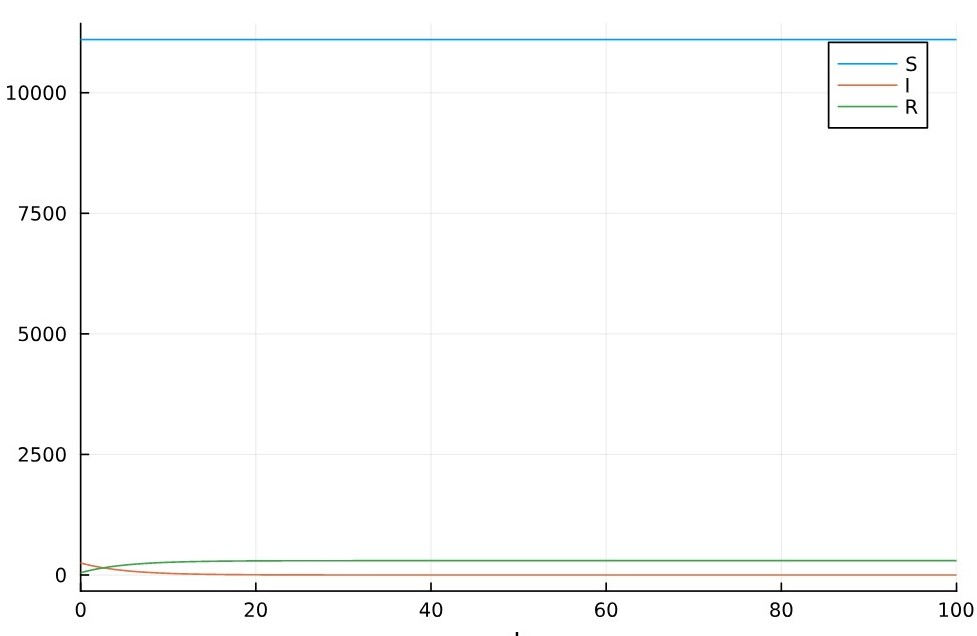
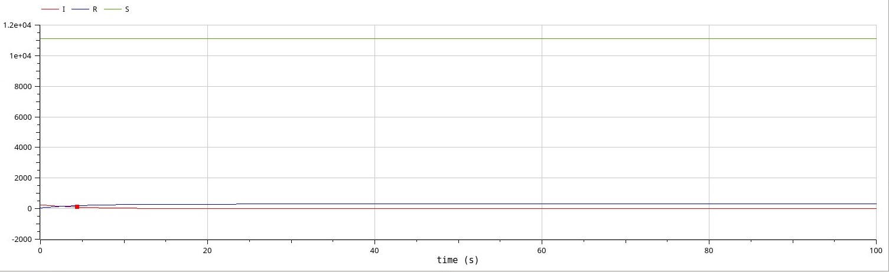

---
## Front matter
lang: ru-RU
title: Лабораторная работа №6
subtitle: Задача об эпидемии
author:
  - Астраханцева А. А.
institute:
  - Российский университет дружбы народов, Москва, Россия
date: 3 мая 2025

## i18n babel
babel-lang: russian
babel-otherlangs: english

## Formatting pdf
toc: false
toc-title: Содержание
slide_level: 2
aspectratio: 169
section-titles: true
theme: metropolis
header-includes:
 - \metroset{progressbar=frametitle,sectionpage=progressbar,numbering=fraction}
 - '\makeatletter'
 - '\beamer@ignorenonframefalse'
 - '\makeatother'
---

# Информация

## Докладчик


:::::::::::::: {.columns align=center}
::: {.column width="70%"}

  * Астраханцева Анастасия Александровна
  * НФИбд-01-22, 1132226437
  * Российский университет дружбы народов
  * [1132226437@pfur.ru](mailto:1132226437@pfur.ru)
  * <https://github.com/aaastrakhantseva>

:::
::: {.column width="30%"}


:::
::::::::::::::


## Цель работы

Исследовать модель SIR (задача об эпидемии)

## Задание

На одном острове вспыхнула эпидемия. Известно, что из всех проживающих
на острове ($N=11400$) в момент начала эпидемии ($t=0$) число заболевших людей
(являющихся распространителями инфекции) $I(0)=250$, А число здоровых людей с
иммунитетом к болезни $R(0)=47$. Таким образом, число людей восприимчивых к
болезни, но пока здоровых, в начальный момент времени $S(0)=N-I(0)- R(0)$.

Постройте графики изменения числа особей в каждой из трех групп.

Рассмотрите, как будет протекать эпидемия в случае:
1) если $I(0)\leq I^*$;
2) если $I(0) > I^*$.

# Случай $I(0)\leq I^*$

## Реализация на Julia

```Julia

function sir(u,p,t)
    (S,I,R) = u
    (a, b) = p
    N = S+I+R
    dS = 0
    dI = -b*I
    dR = b*I
    return [dS, dI, dR]
end

```

## Реализация на Julia

``` Julia
N = 11400
I_0 = 250
R_0 = 47
S_0 = N - I_0 - R_0
u0 = [S_0, I_0, R_0]
p = [1, 0.2]
tspan = (0.0, 100.0)
```

## Реализация на Julia

```Julia
prob = ODEProblem(sir, u0, tspan, p)
sol = solve(prob, Tsit5(), saveat = 0.1)
plot(sol, label = ["S" "I" "R"])
```

## Реализация на Julia

{#fig:001 width=70%}

## Реализация на OpenModelica

```
  parameter Real I_0 = 250;
  parameter Real R_0 = 47;
  parameter Real S_0 = 11109;
  parameter Real N = 11400;
  parameter Real a = 0.01;
  parameter Real b = 0.2; 
  Real S(start=S_0);
  Real I(start=I_0);
  Real R(start=R_0);
equation
  der(S) = 0;
  der(I) = - b*I;
  der(R) = b*I;
```

## Реализация на OpenModelica

{#fig:002 width=80%}

# Случай $I(0) > I^*$

## Реализация на Julia
```Julia
function sir_2(u,p,t)
    (S,I,R) = u
    (a, b) = p
    N = S+I+R
    dS = - a*S
    dI = a*S - b*I
    dR = b*I
    return [dS, dI, dR]
end
```


## Реализация на Julia

``` Julia
N = 11400
I_0 = 250
R_0 = 47
S_0 = N - I_0 - R_0
u0 = [S_0, I_0, R_0]
p = [0.1, 0.05]
tspan = (0.0, 200.0)
```

## Реализация на Julia

```Julia
prob = ODEProblem(sir_2, u0, tspan, p)
sol = solve(prob, Tsit5(), saveat = 0.1)
plot(sol, label = ["S" "I" "R"])
```

## Реализация на Julia

{#fig:003 width=70%}

## Реализация на OpenModelica


```
  parameter Real I_0 = 250;
  parameter Real R_0 = 47;
  parameter Real S_0 = 11109;
  parameter Real N = 11400;
  parameter Real a = 0.1;
  parameter Real b = 0.05;  
  Real S(start=S_0);
  Real I(start=I_0);
  Real R(start=R_0);
equation
  der(S) = -a*S;
  der(I) = a*S - b*I;
  der(R) = b*I;
```

## Реализация на OpenModelica

{#fig:004 width=80%}

## Выводы

В результате выполнения данной лабораторной работы я исследовала модель SIR.

