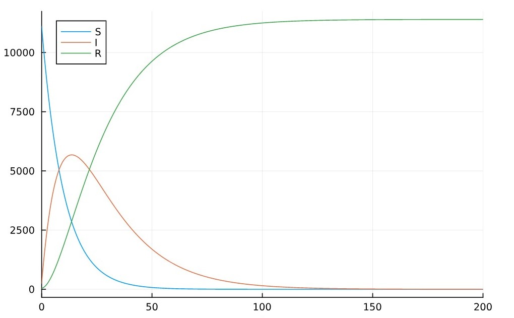
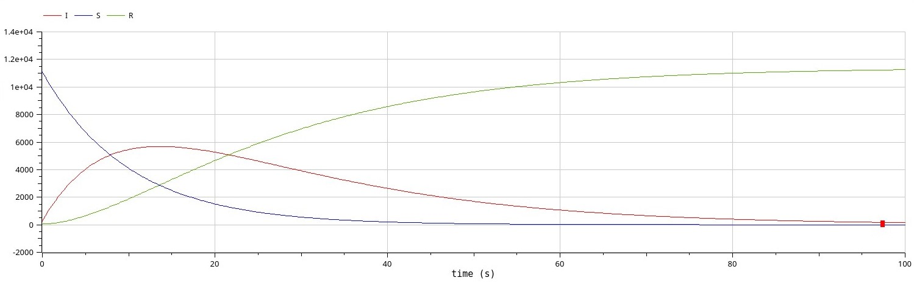

---
## Front matter
title: "Лабораторная работа №6"
subtitle: "Задача об эпидемии"
author: "Астаханцева А. А."

## Generic otions
lang: ru-RU
toc-title: "Содержание"

## Bibliography
bibliography: bib/cite.bib
csl: pandoc/csl/gost-r-7-0-5-2008-numeric.csl

## Pdf output format
toc: true # Table of contents
toc-depth: 2
lof: true # List of figures
lot: false # List of tables
fontsize: 12pt
linestretch: 1.5
papersize: a4
documentclass: scrreprt
## I18n polyglossia
polyglossia-lang:
  name: russian
  options:
	- spelling=modern
	- babelshorthands=true
polyglossia-otherlangs:
  name: english
## I18n babel
babel-lang: russian
babel-otherlangs: english
## Fonts
mainfont: PT Serif
romanfont: PT Serif
sansfont: PT Sans
monofont: PT Mono
mainfontoptions: Ligatures=TeX
romanfontoptions: Ligatures=TeX
sansfontoptions: Ligatures=TeX,Scale=MatchLowercase
monofontoptions: Scale=MatchLowercase,Scale=0.9
## Biblatex
biblatex: true
biblio-style: "gost-numeric"
biblatexoptions:
  - parentracker=true
  - backend=biber
  - hyperref=auto
  - language=auto
  - autolang=other*
  - citestyle=gost-numeric
## Pandoc-crossref LaTeX customization
figureTitle: "Рис."
tableTitle: "Таблица"
listingTitle: "Листинг"
lofTitle: "Список иллюстраций"
lotTitle: "Список таблиц"
lolTitle: "Листинги"
## Misc options
indent: true
header-includes:
  - \usepackage{indentfirst}
  - \usepackage{float} # keep figures where there are in the text
  - \floatplacement{figure}{H} # keep figures where there are in the text
---

# Цель работы

Исследовать модель SIR (задача об эпидемии)

# Задание

**Вариант 28**

На одном острове вспыхнула эпидемия. Известно, что из всех проживающих
на острове ($N=11400$) в момент начала эпидемии ($t=0$) число заболевших людей
(являющихся распространителями инфекции) $I(0)=250$, А число здоровых людей с
иммунитетом к болезни $R(0)=47$. Таким образом, число людей восприимчивых к
болезни, но пока здоровых, в начальный момент времени $S(0)=N-I(0)- R(0)$.

Постройте графики изменения числа особей в каждой из трех групп.

Рассмотрите, как будет протекать эпидемия в случае:
1) если $I(0)\leq I^*$;
2) если $I(0) > I^*$.


# Теоретическое введение

Компартментальные модели являются очень общей техникой моделирования. Они часто применяются для математического моделирования инфекционных заболеваний. Популяция распределяется по компартментам с метками – например, S, I или R (восприимчивый, инфекционный или выздоровевший). Люди могут переходить из компартмента в компартмент. Порядок меток обычно показывает закономерности потоков между компартментами; например, SEIS означает восприимчивый, подвергшийся воздействию, инфекционный, затем снова восприимчивый.

Истоки таких моделей относятся к началу 20-го века, с важными работами Хамера в 1906 году, Росса в 1916 году, Росса и Хадсона в 1917 году, Кермака и Маккендрика в 1927 году и Кендалла в 1956 году. Модель Рида–Фроста также была важным и широко игнорируемым предшественником современных подходов эпидемиологического моделирования.

Модели чаще всего работают с обычными дифференциальными уравнениями (которые являются детерминированными), но могут также использоваться со стохастической (случайной) структурой, которая более реалистична, но гораздо сложнее для анализа.

Эти модели используются для анализа динамики заболевания и оценки общего числа инфицированных людей, общего числа выздоровевших людей и оценки эпидемиологических параметров, таких как базовое репродуктивное число или эффективное репродуктивное число. Такие модели могут показать, как различные вмешательства в области общественного здравоохранения могут повлиять на исход эпидемии.

# Выполнение лабораторной работы

## Случай $I(0)\leq I^*$

Рассмотрим случай, когда число заболевших не превышает критического значения $I^*$, то есть считаем, что все больные изолированы и не заражают здоровых.

### Реализация на Julia

Зададим систему дифференциальных уравнений, описывающих нашу модель, а также начальные условия данные в задаче.

```Julia
function sir(u,p,t)
    (S,I,R) = u
    (a, b) = p
    N = S+I+R
    dS = 0
    dI = -b*I
    dR = b*I
    return [dS, dI, dR]
end


N = 11400
I_0 = 250
R_0 = 47
S_0 = N - I_0 - R_0
u0 = [S_0, I_0, R_0]
p = [1, 0.2]
tspan = (0.0, 100.0)
```


Используя библиотеки `DifferentialEquations` и `Plots` решим систему дифференциальных уравнений и построим соответствующий график.

```Julia
prob = ODEProblem(sir, u0, tspan, p)
sol = solve(prob, Tsit5(), saveat = 0.1)
plot(sol, label = ["S" "I" "R"])
```

В результате получаем следующий график динамики изменения числа людей в каждой из трех групп (рис. [-@fig:001]). Видно, что численность здоровых людей (S) не меняется, поскольку мы рассматриваем случай, когда все больные изолированы, то есть здоровые не заражаются. Число больных уменьшается, а число людей с иммунитетом увеличивается.

{#fig:001 width=70%}

### Реализация на OpenModelica

Здесь мы задаем параметры, начальные условия, систему ДУ и выполняем симуляцию на том же интервале и с тем же шагом, что и в Julia.

```
model lab6_1
  parameter Real I_0 = 250;
  parameter Real R_0 = 47;
  parameter Real S_0 = 11109;
  parameter Real N = 11400;
  parameter Real a = 0.01;
  parameter Real b = 0.2;
  
  
  Real S(start=S_0);
  Real I(start=I_0);
  Real R(start=R_0);
  
equation
  der(S) = 0;
  der(I) = - b*I;
  der(R) = b*I;

end lab6_1;
```

В результате получаем следующий график динамики изменения числа людей в каждой из трех групп (рис. [-@fig:002]). Видно, что численность здоровых людей (S) не меняется, поскольку мы рассматриваем случай, когда все больные изолированы, то есть здоровые не заражаются. Число больных уменьшается, а число людей с иммунитетом увеличивается.

{#fig:002 width=70%}

График, построенный посредством OpenModelica, идентичен графику, выполненном на Julia.

## Случай $I(0) > I^*$

Рассмотрим случай, когда число заболевших превышает критическое значения $I^*$, то есть считаем, что инфицирование способны заражать восприимчивых к болезни особей. 

### Реализация на Julia

Зададим систему дифференциальных уравнений, описывающих нашу модель, а также начальные условия данные в задаче.

```Julia
function sir_2(u,p,t)
    (S,I,R) = u
    (a, b) = p
    N = S+I+R
    dS = - a*S
    dI = a*S - b*I
    dR = b*I
    return [dS, dI, dR]
end
```

``` Julia
N = 11400
I_0 = 250
R_0 = 47
S_0 = N - I_0 - R_0
u0 = [S_0, I_0, R_0]
p = [0.1, 0.05]
tspan = (0.0, 200.0)
```

Используя библиотеки `DifferentialEquations` и `Plots` решим систему дифференциальных уравнений и построим соответствующий график.

```Julia
prob = ODEProblem(sir_2, u0, tspan, p)
sol = solve(prob, Tsit5(), saveat = 0.1)
plot(sol, label = ["S" "I" "R"])
```

В результате получаем следующий график динамики изменения числа людей в каждой из трех групп (рис. [-@fig:003]). Видно, что численность здоровых людей (S) уменьшается, поскольку мы рассматриваем случай, когда больные заражают здоровых. Число больных людей сначала увеличивается, а затем уменьшается, поскольку люди успевают выздоравливать и приобретать иммунитет (это зависит от заданных коэффициентов заболеваемости и выздоровления).

{#fig:003 width=70%}

### Реализация на OpenModelica

Здесь мы задаем параметры, начальные условия, систему ДУ и выполняем симуляцию на том же интервале и с тем же шагом, что и в Julia.

```
model lab6_2
  parameter Real I_0 = 250;
  parameter Real R_0 = 47;
  parameter Real S_0 = 11109;
  parameter Real N = 11400;
  parameter Real a = 0.1;
  parameter Real b = 0.05;
  
  
  Real S(start=S_0);
  Real I(start=I_0);
  Real R(start=R_0);
  
equation
  der(S) = -a*S;
  der(I) = a*S - b*I;
  der(R) = b*I;

end lab6_2;

```

В результате получаем следующий график динамики изменения числа людей в каждой из трех групп (рис. [-@fig:004]).Видно, что численность здоровых людей (S) уменьшается, поскольку мы рассматриваем случай, когда больные заражают здоровых. Число больных людей сначала увеличивается, а затем уменьшается, поскольку люди успевают выздоравливать и приобретать иммунитет (это зависит от заданных коэффициентов заболеваемости и выздоровления).

{#fig:004 width=70%}

График, построенный посредством OpenModelica, идентичен графику, выполненном на Julia.

# Выводы

В результате выполнения данной лабораторной работы я исследовала модель SIR.

## Список литературы

1. Compartmental models in epidemiology [Электронный ресурс]. URL: https: //en.wikipedia.org/wiki/Compartmental_models_in_epidemiology.