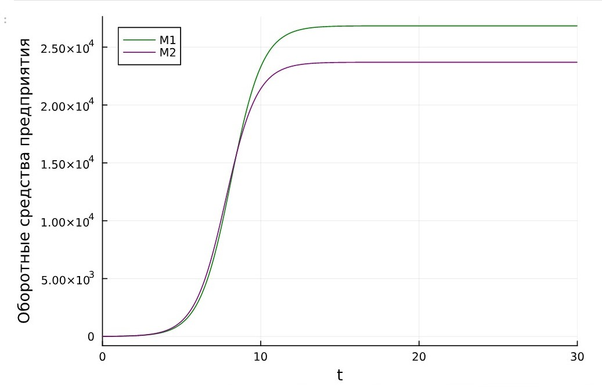
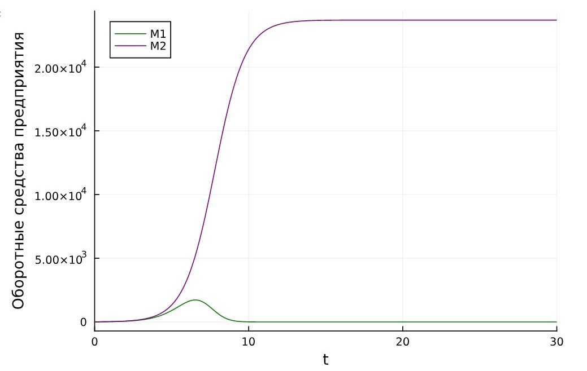
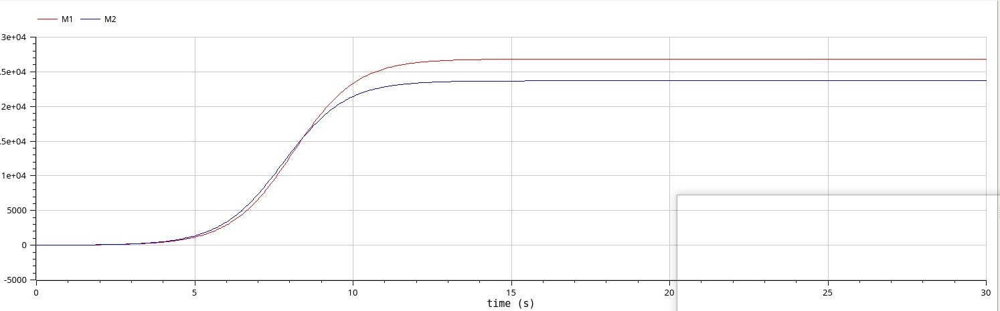
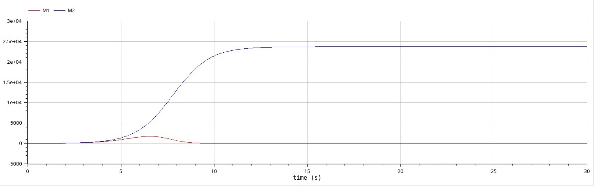

---
## Front matter
lang: ru-RU
title: "Лабораторная работа №8"
subtitle: "Модель конкуренции двух фирм"
author:
  - Астраханцева А. А.
institute:
  - Группа НФИбд-01-22
  - Российский университет дружбы народов, Москва, Россия
date: 31 мая 2025

## i18n babel
babel-lang: russian
babel-otherlangs: english

## Formatting pdf
toc: false
toc-title: Содержание
slide_level: 2
aspectratio: 169
section-titles: true
theme: metropolis
header-includes:
 - \metroset{progressbar=frametitle,sectionpage=progressbar,numbering=fraction}
 - '\makeatletter'
 - '\beamer@ignorenonframefalse'
 - '\makeatother'
---


# Информация

## Докладчик


:::::::::::::: {.columns align=center}
::: {.column width="70%"}

  * Астраханцева Анастасия Александровна
  * НФИбд-01-22, 1132226437
  * Российский университет дружбы народов
  * [1132226437@pfur.ru](mailto:1132226437@pfur.ru)
  * <https://github.com/aaastrakhantseva>

:::
::: {.column width="30%"}


:::
::::::::::::::


# Цель работы

Исследовать математическую модель конкуренции двух фирм.

## Задание. Случай 1

1. Построить графики изменения оборотных средств фирмы 1 и фирмы 2 без
учета постоянных издержек и с веденной нормировкой для случая 1.

Для обоих случаев рассмотрим задачу со следующими начальными условиями и параметрами:
$$M_0^1=8,  M_0^2=9, p_{cr}=35, N=93, q=1, \tau_1=35, \tau_2=30, \tilde{p_1}=13.3, \tilde{p_2}=14.5$$


# Выполнение лабораторной работы

## Реализация на Julia

```Julia
p_cr = 35 #критическая стоимость продукта
tau1 = 35 #длительность производственного цикла фирмы 1
p1 = 13.3 #себестоимость продукта у фирмы 1
tau2 = 30 #длительность производственного цикла фирмы 2
p2 = 14.5 #себестоимость продукта у фирмы 2
N = 93 #число потребителей производимого продукта
q = 1; #максимальная потребность одного человека в продукте в единицу времени

a1 = p_cr/(tau1^2*p1^2*N*q);
a2 = p_cr/(tau2^2*p2^2*N*q);
b = p_cr/(tau1^2*tau2^2*p1^2*p2^2*N*q);
c1 = (p_cr-p1)/(tau1*p1);
c2 = (p_cr-p2)/(tau2*p2);

```

## Реализация на Julia

```Julia
u0 = [8, 9] #начальные значения M1 и M2
p = [a1, a2, b, c1, c2]
tspan = (0.0, 30.0) #временной интервал

function f(u, p, t)
    M1, M2 = u
    a1, a2, b, c1, c2 = p
    M1 = M1 - (a1/c1)*M1^2 - (b/c1)*M1*M2
    M2 = (c2/c1)*M2 - (a2/c1)*M2^2 - (b/c1)*M1*M2
    return [M1, M2]
end
```

## График изменения оборотных средств фирмы 1 и фирмы 2

{#fig:001 width=70%}

## Задание. Случай 2

2. Построить графики изменения оборотных средств фирмы 1 и фирмы 2 без
учета постоянных издержек и с веденной нормировкой для случая 2.


## Реализация на Julia

```Julia
function f(u, p, t)
    M1, M2 = u
    a1, a2, b, c1, c2 = p
    M1 = M1 - (a1/c1)*M1^2 - (b/c1+0.00018)*M1*M2
    M2 = (c2/c1)*M2 - (a2/c1)*M2^2 - (b/c1)*M1*M2
    return [M1, M2]
end

prob = ODEProblem(f, u0, tspan, p)
sol = solve(prob, Tsit5(), saveat = 0.01)
plot(sol, yaxis = "Оборотные средства предприятия", label = ["M1" "M2"], c = ["green" "purple"])
```

## График изменения оборотных средств фирмы 1 и фирмы 2

{#fig:002 width=70%}


# Реализация на OpenModelica

## Случай 1

```
  parameter Real p_cr = 35;
  parameter Real tau1 = 35;  
  parameter Real p1 = 13.3;
  parameter Real tau2 = 30;
  parameter Real p2 = 14.5;  
  parameter Real N = 93;
  parameter Real q = 1;
  parameter Real a1 = p_cr/(tau1^2*p1^2*N*q);
  parameter Real a2 = p_cr/(tau2^2*p2^2*N*q);
  parameter Real b = p_cr/(tau1^2*tau2^2*p1^2*p2^2*N*q);  
  parameter Real c1 = (p_cr-p1)/(tau1*p1);
  parameter Real c2 = (p_cr-p2)/(tau2*p2);
```

## Случай 1
  
```
  Real M1(start=8);
  Real M2(start=9);
  
equation

  der(M1) = M1 - (a1/c1)*M1^2 - (b/c1)*M1*M2;
  der(M2) = (c2/c1)*M2 - (a2/c1)*M2^2 - (b/c1)*M1*M2;
```

## График изменения оборотных средств фирмы 1 и фирмы 2

{#fig:004 width=70%}

## Случай 2

```
  parameter Real p_cr = 35;
  parameter Real tau1 = 35;  
  parameter Real p1 = 13.3;
  parameter Real tau2 = 30;
  parameter Real p2 = 14.5;  
  parameter Real N = 93;
  parameter Real q = 1;
  parameter Real a1 = p_cr/(tau1^2*p1^2*N*q);
  parameter Real a2 = p_cr/(tau2^2*p2^2*N*q);
  parameter Real b = p_cr/(tau1^2*tau2^2*p1^2*p2^2*N*q);  
  parameter Real c1 = (p_cr-p1)/(tau1*p1);
  parameter Real c2 = (p_cr-p2)/(tau2*p2);

```
## Случай 2

```
Real M1(start=8);
  Real M2(start=9);
  
equation
  der(M1) = M1 - (a1/c1)*M1^2 - (b/c1+0.00018)*M1*M2;
  der(M2) = (c2/c1)*M2 - (a2/c1)*M2^2 - (b/c1)*M1*M2;
```

## График изменения оборотных средств фирмы 1 и фирмы 2

{#fig:005 width=70%}


##  Выводы

В результате выполнения лабораторной работы была исследована модель конкуренции двух фирм.


